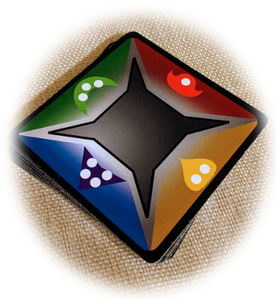
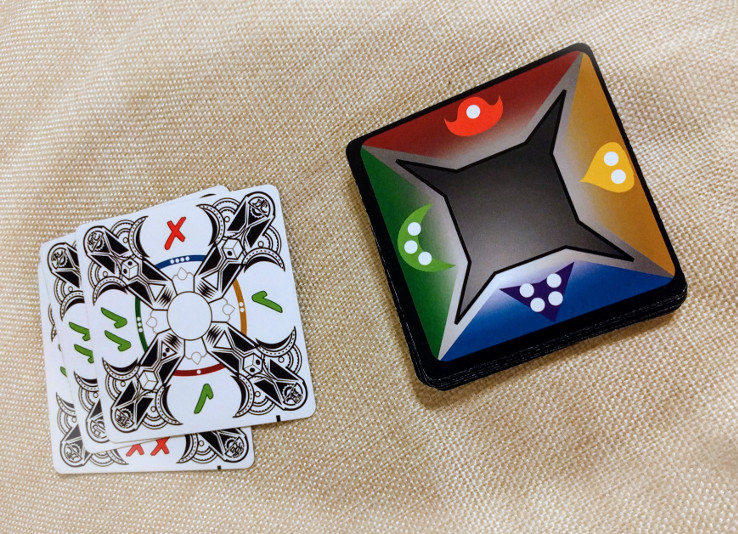
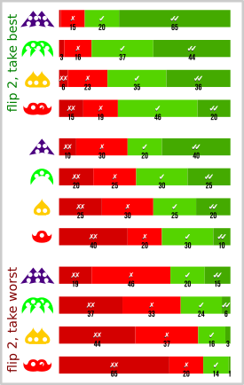

# The Deckahedron

The **Deckahedron** is a deck of 20 square cards.

These cards are designed to be used with role-playing games (RPGs),
for actions where typically dice are used.

## Problem : Arithmetic Is Annoying

In **Dungeons and Dragons**, to see if your character succeeds or
fails at an action, typically you would roll a 20-sided die (d20), then take
the resulting value and add or subtract bonuses or penalties for a new value,
and then check that new value against a *difficulty value*.

Many other role-playing games follow the same formula.  Roll, add/subtract,
compare to the difficulty of the action.

In this way, the odds of success fall along a statistical "curve".

The downside is all the arithmetic. The process *can* be learned and
mastered. Some well-practiced players may not even see the problem because
the arithmetic has become an afterthought. But it is often cumbersome for new
players. Even players familiar with the mechanic sometimes complain that
the mental math breaks the "flow" of the game.

The Deckahedron is designed to replace this process with a simpler one.
Typically, the new process is:

 * Flip a card
 * Look at the side of the card that corresponds to the attribute being used
 * The result of the action is successful if ✔ symbols are shown
 * The result of the action is failure if ✗ symbols are shown

This works because the statistical curve is "baked-in" to the deck of 20
cards.

Generally, each player should have their own Deckahedron from which they
flip cards and that they are responsible for shuffling.

Typically, an action that resolves the question of "Did the
character succeed or fail?" is called a *Resolution Mechanism*.
**Dungeons and Dragons** uses the d20, **Dungeon World** uses 2 six-sided
dice (2d6), and there are many others. There is even a game called
**Dread** that uses the pulling of a block from a stack of wooden blocks.

The Deckahedron was designed to provide at least as much statistical
granularity as **Dungeons and Dragons'** d20 while also giving
easier-to-understand results by "baking in" the statistical curve, and
additionally providing further avenues for play by taking advantage
of the playing card feature of *multidimensionality*.

### Multidimensionality

Besides the ✔ / ✗ resolution mechanism, Deckahedron cards have more
information on their faces.  So a single flip of a card can be used to
play in other ways and to reveal information with other kinds of
statistical curves.

### Critical Success and Critical Failure

In **Dungeons and Dragons**, getting a "20" result from a d20 is called a
"Critical Success" (or "Critical Hit") and similarly rolling a "1" is
called a "Critical Failure".

The Deckahedron has one "Critical Success" (with a green ring) and one
"Critical Failure" (with a red ring) card. Flipping a critical
success or failure card from the Deckahedron has the same odds as rolling
a 20 or 1 with a d20.

#### Substitute d4

If you don't have a 4-sided die (d4) handy, you can use the Deckahedron
as a substitute. Flip over a card from a well-shuffled deck. Count up
the pips showing inside the triangle symbols. That is the equivalent of
rolling a d4.

If there are no pips showing, ignore that card and re-flip.

#### Substitute d6

If you don't have a 6-sided die (d6) handy, you can use the Deckahedron
as a substitute. Flip over a card from a well-shuffled deck. Count up
the pips showing inside the d6 symbols. That is the equivalent of
rolling a d4.

If there are no pips showing, ignore that card and re-flip.

#### The Chinese Zodiac

Near the corners of each card are Chinese characters for animals
in the Chinese Zodiac.  The distribution of these symbols is designed
to make available a mechanic inspired by the game "Spot It" (also
called Dobble).

When you look at the face side of any 2 Deckahedron cards, either:

 * only one of the Zodiac symbols match
 * or all of the Zodiac symbols match

[How to play Spot It](https://www.youtube.com/watch?v=Bc1f-aulfgg)

#### The 2-to-10 curve

     result   probability
     02       ###   (15%)
     03       ###   (15%)
     04       ###   (15%)
     05       ###   (15%)
     06        ##   (10%)
     07        ##   (10%)
     08        ##   (10%)
     09         #   ( 5%)
     10         #   ( 5%)

If you add up the pips shown in the d4 and the d6 symbols, the
possible results and probability distribution is shown above.

### Losing cards

Some Deckahedron games might have consequences where players remove cards
from their Deckahedron. This changes the statistical curve. It can be
done selectively to improve or worsen the player's odds.

### Gaining cards

Some Deckahedron games might have consequences where players add cards
to their Deckahedron, changing the statistical curve.

#### Blessing cards

Blessing cards improve a player's odds of success.

#### Wound cards

Wound cards increase a player's odds of failure.

### Thematic Flips

    [TODO]

## Statistics

Provided as a reference, here are the statistics for success and failure.

    [TODO - more details]
