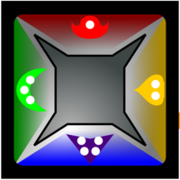

# Deckahedron Foundation

Deckahedron is a system for playing Role Playing Games.

If you've never played a Role Playing Game before, please read
the introduction,
[Deckahedron for the Absolute Beginner](absolute_beginner.md).

Deckahedron is split up into the *foundation* and the *modules*.
This document is the foundation.  The other documents describe the
modules -- optional additions to the rules.  You can keep your
game sessions simple by just using this foundation, or you can
add depth and interesting choices by including some modules.

# Why modules?

One goal of Deckahedron is to make RPGs accessible to new players, so
it is very important that these new players have a great, exciting first
experience.  Most exciting stuff happens *during play*, so by starting
simply, the players can get into the adventure sooner.

It is the aim of Deckahedron that a typical first game with 4 players
should have a 20-minute rules explanation,
and character creation should take around 30 minutes.  The adventure
should begin before the first hour.

# Core Storytelling Mechanism: Attempts and Resolution

Each player controls a character, and contributes to the shared story
by saying what their character thinks, feels and does.  Together, the
players create improvisational back-and-forth as they lead their characters
into dangerous situations and interpersonal conflicts.

At key moments though, the players themselves won't be able to declare
what their character does, and must look to the Storyteller (or GM) to
find out "what happens next?".  This happens at any point that a
character is **attempting** to do something where there's a chance of
failure.

# Core Resolution Mechanic: Character Stats

Characters will have *stats*, **Strength**, **Dexterity**,
and **Intelligence**.  Each will have a rank from 1 to 4.

(If you want a richer representation of characters, see the
[Characters Module](mod_characters.md)
)

When a character attempts an action that is governed by physical strength,
like lifting a heavy gate, they will use their Strength rank to
determine the action's success.

When a character attempts an action that is governed by their reaction
time, nervous system, and fast-twitch muscles,
like leaping onto a running buffalo, they will use their Dexterity rank to
determine the action's success.

When a character attempts an action that is governed by the
grey glob sloshing around in their skull,
like finding clues in an ancient book, they will use their Intelligence
rank to determine the action's success.

# Core Resolution Mechanic: The Deckahedron

The **resolution deck** (or simply "Deckahedron") is made of 20
square cards.
Each edge of a card has a name, color, and number.

 * Anchor, red, 1
 * Bulb, yellow, 2
 * Crescent, green, 3
 * Dart, blue, 4

Whenever a character in the game attempts an action, the player flips a
number of cards (typically just one) and reads the result from the card,
printed on it as either ✗ or ✔ symbols.

Let's examine a simple example:

 1. The character attempts an action governed by Strength
 2. The player flips over the top card in their Deckahedron
 3. The character has a strength rank of 3
 4. So the player looks at the ✗ or ✔ symbols on the edge marked with 3 pips
    (the "green" or "Crescent" edge)
 5. If those symbols are:
  * ✗✗: the attempt was a categorical failure
  * ✗: the attempt was a failure
  * ✔: the attempt was a success
  * ✔✔ : the attempt was an unconditional success

