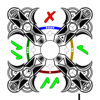
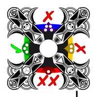
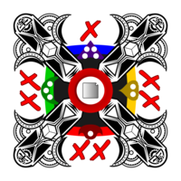

# Deckahedron Module: Combat

The Combat Module tells you when your character is able to endure
exertion and injury to keep moving forward and tells you when your
character is completely spent and collapses in a heap.

When a character is in a fight, they are running, dodging, striking, and
being struck and assailed by their foe.  All of this stuff is scary and
exhausting. So a character will get weaker the longer they're in this
exchange, even if they're dodging every blow.

This weakening is represented by cards from your Deckahedron being lost
into your *Exhaustion pile*.

This module provides 2 modes.  You can choose which mode you want depending
on what kind of game you want to play: the **Heroic Mode** and the
**Gritty Mode**.

## Stamina / Exhaustion - Heroic Mode

> Heroic Mode moves faster and takes less explanation.  It can also be "easier"
> because players might get lucky and lose only their "bad" Deckahedron
> cards to the *Exhaustion pile*.

Characters have 10 Stamina points.  These points are represented by
cards placed in their *Exhaustion pile*

To win a combat, a character's foes must be subdued or pacified before the
player's *Exhaustion pile* has grown to 10 cards.

When you are instructed to lose a Stamina point:

 * move the top card of your deckahedron to your "Exhaustion pile".  Keep it
   face-down (don't look at the face side)

(You can put an Exhaustion token on top of the *Exhaustion pile* to
distinguish it from your *discard pile*)

Once there are 10 cards in your *Exhaustion pile* then your character is
*incapacitated* and can take no further actions.  It is up to the Storyteller
to decide what this incapacitation means - whether the character is dead,
unconscious, or just unable to stand or move.

## Stamina / Exhaustion - Gritty Mode

> Gritty Mode tries to simulate the negative consequences of exhaustion.
> Players will lose only their "good" cards to the *Exhaustion pile*

Characters have 10 Stamina points.  These points are represented by
cards in your Deckahedron with a Stamina symbol

Card **with** a Stamina symbol in the center | Card **without** a Stamina symbol
---------------------------------------------|----------------------------------
       | 

To win a combat, a character's foes must be subdued or pacified before the
player's Deckahedron has been emptied of Stamina points.

When you are instructed to lose a Stamina point:

 * flip cards in your Deckahedron until you find a card with a Stamina symbol
 * stop flipping and put that card aside, face-up in your *Exhaustion pile*
 * the other flipped over cards go into your *discard pile*

(You can put an Exhaustion token on top of the *Exhaustion pile* to
distinguish it from your *discard pile*)

(So, if you were instructed to lose 3 Stamina points, you would add 3 cards
with Stamina symbols onto your Exhaustion pile)

Note: Players *may* reshuffle their *discard pile* back into the Deckahedron
before searching for Stamina points. If searching through their Deckahedron
does not yield a card with a Stamina symbol, the player **must** reshuffle
their *discard pile* into the Deckahedron and continue searching.

If there are no Stamina points in the Deckahedron *or* the *discard pile*,
then all 10 must be in the *Exhaustion pile*. In this case, the character
is *incapacitated* and can take no further actions.
It is up to the Storyteller to decide what this incapacitation means - whether
the character is dead, unconscious, or just unable to stand or move.

## 10 Stamina Max?

You may be wondering if characters can ever have more than 10 Stamina.
Depending on the Skills, Attributes, Items, Classes and Races available in
your setting, you will have the option to take an Exhaustion token instead
of losing a Stamina point.

See those relevant modules for more information.

## Taking a Breather

*Taking a breather* is an action that a character can take during combat.
This action allows a character to regain Stamina points.

The player can use either Intelligence or Dexterity to perform the *Take a
Breather* action.

If they use Intelligence, they say how they execute a tactic or
recognize a favourable position that lets them gather their breath
and their wits. Then they flip a card.

If they use Dexterity, they say how they maneuver into a safe position
that offers some temporary safety. Then they flip a card.

Card shows | Consequences
-----------|--------------
 ✔✔        | character regains 1d4 Stamina
 ✔         | character regains 1d4 Stamina, but their foe moves to a superior position
 ✗         | character regains 1 Stamina, but their foe moves to a superior position
 ✗✗        | character regains nothing and their foe moves to a superior position

Note: "regain Stamina" can be done either by taking cards from the
*Exhaustion pile* and putting them into the *discard pile*, or by discarding
Exhaustion tokens.

## Lasting Harm: Strains / Sprains / Bruises

Strains, sprains, and bruises are meant to represent either bodily harm
or mental strain that is so significant that the negative effects will last
for a while.

When you are instructed to take a Strain, sprain, or bruise:

 * **If you already have 2 Harm tokens on your Exhaustion pile**:
   - Take a *Wound* instead
 * **Otherwise**:
   - the Storyteller will describe what kind of harm this represents
   - Lose a Stamina point
   - Place a *Harm token* on your *Exhaustion pile*

## Resting

*Resting* is an action that a character can take when they are out of combat,
not travelling, and have several hours to devote to rest (sleeping qualifies).

 * Discard all *Exhaustion tokens*
 * Discard one *Harm token*
 * Count the remaining *Harm* and *Wound* tokens on your *Exhaustion pile*
 * Keep that many cards (chosen at random) in your *Exhaustion pile*, put
   the rest into your *discard pile*

Note: Time devoted to *Resting* cannot also be devoted to learning skills,
studying with a teacher, or any other action that takes mental or physical
effort.

## Wounds

Getting wounded sucks, and when wounded, all intelligent creatures seek
to cure their condition as a very high priority.

When you are instructed to take a Wound:

 * **If you already have 2 wounds**:
   - the character is incapacitated
 * **Otherwise**:
   - the Storyteller will describe how the character was wounded
   - Lose a Stamina point
   - Place a *Wound token* on your *Exhaustion pile*
   - Place a *Wound card* in your *discard pile*. It will now start cycling
     between your Deckahedron and your *discard pile*.

Having a *Wound card* in your Deckahedron causes some nasty effects.

Whenever you flip and reveal a wound card (ie, when resolving an attempt):

 * Say or act out the gutteral noise emitted by your character
 * You must immediately stop flipping (eg, if your skill or the
   action instructed you to "flip 3", you would stop short once you hit
   the wound card - resolve the attempt with only the card(s) you flipped)
 * Lose a stamina point

## Healing

*Healing* is an action that a character can take when they are in a peaceful
environment and have time and resources to spend on self-care.

Eg, if they are in a primitive camp posessing medicine men or a
contemporary city with doctors and hospitals or a tranquil oasis infused
with healing magic.

Healing can also be effected by equipment and skills.
See [Equipment](mod_equipment.md) and [Characters](mod_characters.md)

When you spend a day healing:

 * Describe your character's healing experience
 * Discard all *Exhaustion tokens*
 * Discard all *Harm tokens*
 * Discard one *Wound token*
 * Count the remaining *Wound* tokens on your *Exhaustion pile*
 * Keep that many cards (chosen at random) in your *Exhaustion pile*, put
   the rest into your *discard pile*

As with *Resting*, time spent *Healing* cannot also be used in activities that
take effort.

## Attacking: Unopposed flips

Any attack where the foe is caught unaware is done by an unopposed flip.
The player taking the action:

 * Flips Dex (ranged weapon) or Str (handheld weapon)

Card shows | Consequences
-----------|--------------
 ✔✔        | deal 1d4 fatigue
 ✔         | deal 1d4 fatigue
 ✗         | miss
 ✗✗        | miss

In either case, the foe is now aware that the fight is on.

## Attacking: Opposed flips

### Ranged attacks:
This is modeled as a "volley" or "spray" attack.  The player should
account for ammo "points" for their weapon.  One of the consequences
can be to lose one of those ammo points.

In ranged combat is that, even when you don't hit an opponent, you can
cause them to stay in the cover they've got, dive for the floor, or
interrupt their current action.  Here, we'll call this "pinned"

 * Both the attacker and the defender flip Dex

 * ✔✔ v ✔✔ - deal 1d4 fatigue / foe can choose to move
 * ✔✔ v ✔  - deal 1 fatigue / foe pinned
 * ✔✔ v ✗  - deal 1d4 fatigue / foe pinned
 * ✔✔ v ✗✗ - critical hit: 1d4 fatigue includes a *Harm* token

 * ✔ v ✔✔ - deal 1 fatigue / foe can choose to move
 * ✔ v ✔  - you choose: 1 fatigue or foe pinned
 * ✔ v ✗  - you choose: 1d4 fatigue or foe pinned
 * ✔ v ✗✗ - deal 1d4 fatigue / foe pinned

 * ✗ v ✔✔ - lose ammo / foe can choose to move
 * ✗ v ✔  - lose ammo
 * ✗ v ✗  - simple miss
 * ✗ v ✗✗ - foe pinned

 * ✗✗ v ✔✔ - lose ammo and lose 1 Stamina
 * ✗✗ v ✔  - lose ammo / foe can choose to move
 * ✗✗ v ✗  - lose ammo
 * ✗✗ v ✗✗ - lose ammo / foe pinned

### Melee attacks:

 * Both the attacker and the defender flip Str

 * ✔✔ v ✔✔ - deal 1d4 fatigue / foe deals 1d4 fatigue
 * ✔✔ v ✔  - deal 1d4 fatigue / foe deals 1 fatigue
 * ✔✔ v ✗  - deal 1d4 fatigue
 * ✔✔ v ✗✗ - critical hit: choose: 1d4 + 1 fatigue or deal a *Wound*

 * ✔ v ✔✔ - deal 1 fatigue / foe deals 1d4 fatigue
 * ✔ v ✔  - deal 1 fatigue / foe deals 1 fatigue
 * ✔ v ✗  - deal 1d4 fatigue
 * ✔ v ✗✗ - you choose: deal 1d4 fatigue or deal a *Harm*

 * ✗ v ✔✔ - you choose: take 1d4 fatigue or drop a piece of equipment
 * ✗ v ✔  - take 1 fatigue
 * ✗ v ✗  - clash - get up in their face and say something nasty
 * ✗ v ✗✗ - foe cannot do fatigue next turn

 * ✗✗ v ✔✔ - take 1d4 fatigue
 * ✗✗ v ✔  - you choose: take 1d4 fatigue or drop a piece of equipment
 * ✗✗ v ✗  - pushed to the ground - you cannot do fatigue next turn
 * ✗✗ v ✗✗ - both are pushed to the ground

## Attacking: Damage and Fatigue

Though it is called "dealing fatigue", it generally represents the exhaustion
that comes with the physical exertion of jumping for cover or swinging
weapons at each other.  The game is made more fun when these acrobatics are
described.  The Storyteller is the final decider, but both the Storyteller
and the player can improvisationally describe what the fatigue or damage is.

## Other kinds of attacks

The "Ranged" and "Melee" actions described in this document are very simple
and can make for some fun adventures, but after a couple adventures with these
rules, your players might be craving more depth and more mechanical
possibilities.  It's highly recommended that you take a look at additional
modules which overwrite the Attack rules in this base Combat Module.

See the [Equipment](mod_equipment.md),
[Deckahedron World](mod_deckahedron_world.md), and
[Thematic flips](mod_thematic_flips.md)
modules for other kinds of combat rules.

## Rationale for Stamina / Harm / Wounds Mechanics

### Stakes

All actions have consequences, not just the action that takes a character from
"alive" to "dead".

### Visibility

It's easy to see the players' *Exhaustion piles*, and their *Harm* and *Wound*
tokens.

Keeping these facts visible helps the Storyteller add new events with the
right amount of difficulty.

It can also help players easily see how their teammates are faring - perhaps
causing them to decide when to fall back in support of their teammates versus
pressing forward an attack.

