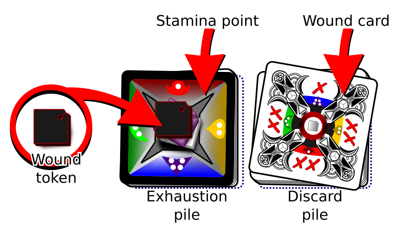

# Deckahedron World - Player's Guide

This is an adaptation of
[Dungeon World](http://www.dungeon-world.com/)
for the
[Deckahedron System](foundation.md)

# Tagline

Like board games?  Remember Dungeons & Dragons? Think you can improv?
Welcome to Deckahedron World!

# Outline

```
    - SESSION 0 (Sarukkan's Chamber) RULES
p1      - RPG intro.  What to do. Say/Flip/Move/Roll. GM/Player
p2-p3   - Deckahedron - Basic Moves - when to flip, how to flip - lots of pics
    - SESSION 1 RULES
p4-p6   - Combat - Stamina/Harm/Wounds - GM: moving the spotlight
p6      - Set up an advantage with Discern Realities, Defend
p7      - Moves - Do a Flashback, Critical Flip
    - SESSION 2 RULES
p8      - More Moves - Take a Breather, Rest, Heal
p9      - More Moves - Speed/Equip/Wealth - Run, Shop, GTIB, S+S
p10     - Mundane Items - Armor, weapons
p11     - More Moves - Use a Magic Item, EtBB, CtLL
p12-p14 - Starting a game, Sarukkan's Chamber, Character Creation
    - SESSION 3 RULES
p15     - Levelling Up - Study / Craft, Level circles
```

```
p1
```
# Welcome to Role-Playing

Deckahedron World is a system for telling a story.  The authors of the story
are you and your friends, sitting around a table.

This story is improvisiational, interactive, and collaborative.

The rewards for playing are laughter and excitement while you play, and
warm conversations for years afterwards that start with "Remember that time
we were playing Deckahedron World and..."


## How to make a great story

Imagine the audience for this story is the inner children of all the players.
What evokes the feelings we had when we were children playing pretend? Can
you remember being 11 years old and watching a spectacular Steven Spielberg
movie?  Or maybe a cheap-but-awesome Sam Raimi movie?

You are going to collaborate with all the other players to make this story,
so when you add your parts, think of what will give your friends around the
table a thrill, put them in suspense, ratchet up their feelings of tension,
or make their jaws drop with awe.

Sometimes inner children get a big kick out of blood and guts.
Your inner child might giggle at the brothel scenes in HBO's Game of
Thrones. If you don't know what topics your friends consider "off-limits",
it is a good idea to ask and tell before you start playing.

The story that emerges from Deckahedron World is not a precisely crafted
thing. That's ok. It doesn't have to be high art or even a cartoon on Adult
Swim. It gets shaped by each player, and when your turn comes, you
adapt, do your best improvisational "Yes, and", and see where it goes from
there. It might sound like chaos, but with some faith in your friends, you
will delight at how the plot solidifies, and how real the characters
become.


## Specifically, What to do

Roles - GM, Player

GM: Know all the rules, say stuff.  Your domain is the world.
Players: 50% Say stuff, 25% Flip your Deckahedron, 12% Move tokens around,
12% Roll dice.  Your domain is your character.

Player:

 * Describe your character and their actions
    * Refer to your moves to get ideas for your character
    * Act out their dialogue
    * Tell *how* they act
       - flourishes and stunts
       - their facial expressions, voice, and body language
    * Tell what they say / hear / see / smell / taste / feel
    * Describe their thoughts & memories
    * Chime in when they interact with / support the other characters

 * Tell parts of the story
    * Refer to your moves to see what boundaries you can push
    * Tell your character's backstory
    * Control hirelings and animal companions


```
p2-p3
```
# The Deckahedron

Every player except the GM gets a Deckahedron. Inspect your Deckahedron.
You should have 20 cards.  There are 4 symbols on the fronts and
backs of the cards:

Name      | symbol                                  | odds                              | color  | rank
----------|-----------------------------------------|-----------------------------------|--------|-------
Anchor    |      | indicates the weakest odds        | red    | rank 1
Bulb      |          | indicates below average odds      | yellow | rank 2
Crescent  |  | indicates above average odds      | green  | rank 3
Dart      |          | indicates the best odds           | blue   | rank 4

Shuffle your Deckahedron and place it face-down in front of you.

Whenever your character attempts something risky, where the outcome is
not certain, the GM calls on you to use your Deckahedron and "flip".

First, the GM names the move you're attempting and which of your
character's attributes -- Strength, Dexterity, or Intelligence -- you
use to resolve the flip.

    GM Note: The attributes used to resolve a move are listed at the top
    of each card.  Sometimes a card gives the option of several
    attributes, like "Str / Dex".  You may need to ask the player for more
    detail about what they are attempting before calling for a flip.


Look at the attribute on your character sheet -- what symbol is it, Anchor,
Bulb, Crescent, or Dart? Rotate your Deckahedron so that the symbol is
facing forward (away from you). Take the top card by the edge closest to
you and flip it forward so the edge is now farthest from you.  Saying "Bam!"
or making some other sound effect is recommended. Now the card is
face-up and the symbol is facing forward.


The top of the flipped card shows ✗s or ✔s.


Finally, find the move card named by the GM and read its instructions.
It tells you how the GM should interpret the ✗s and ✔s.

Afterward, any card used during a flip goes face-up in a *discard pile*.
Later, you will start another pile of face-up cards called an
*Exhaustion pile*.  Keep them separate.

## For example,

You're playing a character named Kresk.  You say:

> Kresk sees the pit of spikes in front of him, but isn't scared.
> He just takes a running start and mightily leaps over the pit,
> landing safely on the other side.

The GM might say to you:

> Ok, sounds good, but let's see if Kresk's legs are strong enough.
> Please flip Defy Danger with your Strength.

Look over at the character sheet and see that Kresk has rank 3
(Crescent) Strength. Rotate your Deckahedron so that the Crescent
symbol is forward, then flip over the top card.

Maybe you get a single ✔. The GM uses the instructions on the
Defy Danger card ("You do it, but there's a new complication") to
improvise what happens next:

> You leap through the air, landing with a thud on the other
> side of the pit, kicking up a cloud of dust on this forgotten
> jungle trail. Rising to your feet, you notice that more than
> dust has been stirred. The sounds of movement and a threatening
> rattle alerts you to something approaching from inside the pit.
> What do you do?

## Other ways to flip: Advantage / Disadvantage

Some flips are a little more complicated. Some moves in Deckahedron
World instruct you to "take +1 advantage", "add an advantage card"
or "flip with advantage". Sometimes you are given the opposite
instruction, "add a disadvantage card" or "flip with disadvantage".

### Advantage

With an advantage, flip over your top card as usual, and then
flip over the next card as well.
Compare the results (the number of ✗s or ✔s)
and *resolve the flip* with the card that has the **best** result.

If it's a tie, you may choose whichever card to be the card that *resolves
the flip*.

All cards that got flipped face-up go in your *discard pile*.

#### Complete Flip Rule

You must flip over all the cards you were instructed to, even if the first
card shows ✔✔.


### Disadvantage

With a disadvantage, do the same thing, but use the **worst** result.

### Multiple Advantages / Disadvantages

For a given flip, you may be instructed to add two advantage cards or two
disadvantage cards.  This means you flip **3 cards in total** and take
the **best** or **worst**, respectively.

No flip may use more than 3 cards in total, so adding advantage cards past 2
is just ignored.

Sometimes there's a situation where you are instructed to both
"flip with advantage" and "flip with disadvantage".
To resolve any of these combinations,
simply add up all the advantages, and then subtract all the disadvantages
to arrive at your sum of advantage or disadvantage.
The maximum is two extra cards, so if the sum is -3, you only
flip with two disadvantage cards.


## Other flip complications: Green token cards


Some Deckahedron cards have a green token symbol in the middle.
After a flip is resolved by a card showing a green token symbol,
you have a choice:

 * Take a green token from the supply
 (these may be spent later to perform certain moves)
 * Go up one level in the move just performed
 (see [Move Levels](#move_levels))

You may only do this when the card *resolves* a flip. (ie, when flipping
multiple cards, *this* was the one from which the ✗ or ✔ symbols were
used to interpret the result of the move)

## Other flip complications: Wound cards

Sometimes you flip over a Wound card.  See the
[Combat chapter](#combat).


## Reshuffling

At any time before a flip, or after a flip is resolved, you may take your
*discard pile* and shuffle it back into your Deckahedron.

Whenever your Deckahedron is down to 5 or fewer cards, you **must** take
your *discard pile* and shuffle it back into your Deckahedron.


## GM Notes: What to do on flips

When a player is performing a move, you should read the move card so that
you can interpret the result of the flip. Usually ✔✔ means an unfettered
success, and single ✔ means success, but with complication.

When the result is a single ✗, it is sometimes the same as a single ✔, but
often it is slightly worse. When a flip results in a single ✗, even when
the move card says it has the same narrative effect as a single ✔, you
should add a point to your *Bad Bank*.  See the GM Guide.

When the result is ✗✗, it is your turn to make a move. You narrate the
consequences of the move the player just attempted and you have license to
take the narrative where you'd like.  See the GM Guide.

Rarely, a card will have instructions for how to interpret a ✗✗ result.
These instructions should be executed, but might only be *part* of the
GM's move.

There is an exception to the GM moves on ✗ and ✗✗.  When the move card
has the tag *IMMEDIATE*, the GM does not add points to the *Bad
Bank* on a ✗ and they don't make a move on a ✗✗.

### GM: Examples for spending points from the *Bad Bank*

 * Make a "soft" move
 * Give a foe an extra starting Stamina point
 * Reduce a friendly NPC's starting Stamina points
 * Give a foe +1 to the next time they do damage
 * Make a cost a bit more expensive
 * Make a treasure a bit less valuable
 * One of the character's resources gets cosmetically changed

## GM Moves

 * The Dungeon World moves
 * Player loses confidence in the skill they just tried.  Put a white-side red card on it until they use it and flip a ✔ or ✔✔
 * "Call for an Ad-Hoc Challenge"
  - eg, "Something feels weird about this bridge. Flip Int to notice
    what the problem is"
    (It's implied that either ✔ or ✔✔ are needed to succeed)
  - eg, "Anyone who wants to race to the edge of the bridge before
    it collapses must have at least 2 speed and get ✔✔ on a Dex flip"
    (The GM is allowed to consider other aspects than just Int / Str / Dex)
  - eg, "You're all in the moat. Spend a green token and describe how
    your character learned to swim, or else begin thrashing and drowning.
    If you spend the green token, write 'swimming' on your character
    sheet."

 * On a *critical failure* flip, the GM may use 3 banked points to make
   an additional move


## GM responsibility: moving the spotlight

Never let a player's turn to be inconsequential. A player might wait
10 minutes for their friends' moves, so if their whole turn in the
spotlight ends with "nothing happens" this game will be very unfun.
Give them an opportunity for something. This doesn't mean they have
to slay a demon on every turn, merely getting a big laugh can
be "something".

Remember, this is a collaborative story.  Laughter and excitement
are the rewards for everyone.

```
p4-p6
```
# Combat - Stamina/Harm/Wounds

Here are rules to determine when your character is able to endure
exertion and injury to keep moving forward or when they're completely
spent and collapsed in a heap.

When a character is in a fight, they are running, dodging, striking, and
being struck and assailed by their foe.  All of this stuff is scary and
exhausting. So a character gets weaker the longer they're in this
exchange, even if they're dodging every blow.

This weakening is represented by cards from your Deckahedron being lost
into your *Exhaustion pile*.

Think of a boxing match or a mixed martial arts match. During the later
rounds, the athletes are worn down, don't jump around the ring with as
much vigor, and drop their guard more frequently. The contest is not
always decided with a knockout punch, it often comes down to who can
better endure the exertion.

## Phases

When your character gets attacked or falls victim to some other danger,
you have choices about exactly how they are affected. They may dodge,
and just lose Stamina, they may stand stubbornly against a blow,
taking Harm to perhaps absorb the blow with their armour (or with their
face), or they may be wounded by the attack.

The **first phase** is rolling dice to arrive at a number. This number
is called the *attack power*.

The **second phase** is deciding how to split that number among 3
categories, Stamina, Harm, or Wounds.

The **third phase** is optional: absorbing some points using any relevant
move cards and item cards.

Finally, the **fourth phase**: you interpret those results into the
narrative.  Did your character dive into the dirt?  Did they take a punch
to the jaw and respond with a bloodied grin?  Did the spear bounce right
off their steel breastplate?

### First Phase

When violence is applied to your character, you roll dice to get a number.
Call this number the *attack power*.

### Second Phase

If you don't split up the *attack power*, it translates directly into Stamina
points. So by default, your character loses that amount of Stamina points.

Let's say your character was attacked with a sword and the dice were rolled
and summed up to 7.  The simplest thing is to lose 7 Stamina points.

But maybe you only have 7 Stamina points left in your deck, and you don't
want your character to be incapacitated. You have a couple options:

 * Turn *attack power* into Harm tokens at a rate of 3-for-1
 * Turn *attack power* into Wound tokens at a rate of 6-for-1

For example, you may split the attack power of 7 into:

 * 4 Stamina points
 * 1 Harm token

You may even do that twice, splitting the attack power of 7 into:

 * 1 Stamina point
 * 2 Harm tokens

Another option is to take a Wound, using a rate of 6-for-1.
In our example, you may split the attack power of 7 into:

 * 1 Stamina point
 * 1 Wound token

Note: as described later, taking Wound and Harm tokens can sometimes also
cause loss of Stamina points.


## Stamina / Exhaustion

Characters have 10 Stamina points.  These points are represented by
cards in your Deckahedron with a Stamina symbol


To win at combat, a character's foes must be subdued or pacified before the
player's Deckahedron has been emptied of Stamina points.

When you are instructed to lose a Stamina point, you may absorb it
using any relevant move cards and item cards, otherwise:

 1. reveal cards in your Deckahedron until you find a card with a Stamina symbol
 2. put that card aside, face-up in your *Exhaustion pile*
 3. the other revealed cards go into your *discard pile*


You should put an Exhaustion token on top of the *Exhaustion pile* to
distinguish it from your *discard pile*. But, unlike Harm and Wound tokens,
you don't have to put an Exhaustion token on the pile for each Stamina point
lost, that's what the cards are for.


(So, if you were instructed to lose 3 Stamina points, you add 3 cards
with Stamina symbols onto your Exhaustion pile)

If searching through their Deckahedron does not yield a card with a Stamina
symbol, the player **must** reshuffle their *discard pile* into the
Deckahedron and continue searching.

Note: Players *may* choose to reshuffle their *discard pile* back into the
Deckahedron *before* searching for Stamina points.

If there are no Stamina points in the Deckahedron *or* the *discard pile*,
then all 10 must be in the *Exhaustion pile*. In this case, the character
is *incapacitated* and can take no further actions.
It is up to the GM to decide what this incapacitation means - whether
the character is dead, unconscious, or just unable to stand or move. The
GM has rules for this, see the GM Guide.


## Harm

Think of that boxing match again.  If Stamina represents dancing, ducking,
and dodging, then Harm represents landing a blow.
These rules are also for representing mental strain that is so significant
that the negative effects last for a while.

When you are instructed to take a Harm token, you may absorb it
using any relevant move cards and item cards, otherwise:

 * **If you already have 2 Harm tokens on your Exhaustion pile**:
   - Take a *Wound* instead
 * **Otherwise**:
   1. Lose a Stamina point
   2. Place a *Harm token* on your *Exhaustion pile*


## Wounds

Getting wounded sucks, and when wounded, all intelligent creatures seek
to cure their condition as a very high priority.

When you are instructed to take a Wound token, you may absorb it
using any relevant move cards and item cards, otherwise:

 * **If you already have 2 wounds**:
   - the character is incapacitated
 * **Otherwise**:
   - the GM describes how the character was wounded
   - Lose a Stamina point
   - Place a *Wound token* on your *Exhaustion pile*
   - Place a *Wound card* in your *discard pile*. It will now start cycling
     between your Deckahedron and your *discard pile*.



### A Wound Card

 |

Having a *Wound card* in your Deckahedron causes some nasty effects.

Whenever you **flip** and reveal a wound card, follow these rules:

 * Say or act out the gutteral noise emitted by your character
 * You must immediately stop flipping (eg, if your the move
   instructed you to "flip 3", you stop short once you hit
   the wound card - resolve the move with only the card(s) you flipped.
   This overrides the **Complete Flip Rule**)
 * Lose a stamina point


# Flipping Green - get a green token


# More Moves - Do a Flashback, Critical Flip


# More Moves - Take a Breather, Rest, Heal

## Taking a Breather

**Taking a Breather** is a move that a character can take during combat.
This action allows a character to regain Stamina points.

The player may use either Intelligence or Dexterity to perform the **Take a
Breather** action.

If they use Intelligence, they say how they execute a tactic or
recognize a favourable position that lets them gather their breath
and their wits. Then they flip a card.

If they use Dexterity, they say how they maneuver into a safe position
that offers some temporary safety. Then they flip a card and follow the
instructions on the card to see how many Stamina they regain.

Note: "regain Stamina" may be done either by taking cards from the
*Exhaustion pile* and putting them into the *discard pile*, or by discarding
Exhaustion tokens.

When taking cards from the *Exhaustion pile*, the player may choose any cards
they want.

    GM Note:
    When appropriate for the narrative (e.g. when there's a scene transition
    and the characters are just walking down a hallway), the GM may prompt the
    players to **Take a Breather** as an IMMEDIATE move.


## Resting

*Resting* is an action that a character may take when they are out of combat,
not travelling, and have several hours to devote to rest (sleeping qualifies).

 * Step 1: Discard all *Exhaustion* tokens
 * Step 2: Count the *Harm* and *Wound* tokens on your *Exhaustion pile*
 * Step 3: Keep that many cards (player choses which ones) in your *Exhaustion pile*,
   put the rest into your *discard pile*
 * Step 4: Discard one *Harm* token

Note: Time devoted to *Resting* cannot also be devoted to learning skills,
studying with a teacher, or any other action that takes mental or physical
effort.

When resting, magic items regain all charges, up to their maximum capacity.
Remove all white-side red cards on your magic items.

You may gird all your armour, where applicable.
Remove all Harm and Wound tokens from your armour cards.

## Seek Help

*Seeking Help* is an action that a character may take when they are in a
peaceful environment where external resources with healing powers are
available.

Eg, if they are in a primitive camp posessing medicine men or a
contemporary city with doctors and hospitals or a tranquil oasis infused
with healing magic.

When you spend a day healing:

 * Step 1: Describe your character's healing experience
 * Step 2: Discard all *Exhaustion* tokens
 * Step 3: Discard all *Harm* tokens
 * Step 4: Count the *Wound* tokens on your *Exhaustion pile*
 * Step 5: Keep that many cards (player choses which ones) in your
   *Exhaustion pile*, put the rest into your *discard pile*
 * Step 6: Discard one *Wound* token

As with *Resting*, time spent *Seeking Help* cannot also be used in
activities that take effort.

Magic items regain all charges, up to their maximum capacity.
Remove all white-side red cards on your magic items.

You may gird all your armour, where applicable.
Remove all Harm and Wound tokens from your armour cards.


# Speed/Equipment/Wealth

## More Moves - Run, Shop, Good Thing I Brought..., Sharpen and Stitch

### Bravely Run Away
### Shop / Procure

Make mundane items - here's the process... TODO

Don't hand a player a card they can't use because they don't have the
requirements.

### Good Thing I Brought...
### Sharpen and Stitch

# Mundane Items

## Armor, weapons

# More Moves - Use a Magic Item, Entreat the Blood-Bound, Channel the Living Light

Ask that player "Who is the Blood-Bound"?

    GM Note: this is a great way to stretch your improv muscles. Say "Yes,
    and..." no matter if they identify the Blood-Bound as tiny, parasitic
    insects or as monstrous, extradimensional dark gods.

```
p12-p14
```
# Starting a game

## Sarukkan's Chamber

## Making your own character

Spread out A, B, C cards, take turns picking

Items - 2 mundane items or 1 magic item

"Use a Magic Item" move gives you 2 magic items

A player inevitably asks why the magic amulet or ring they've created,
a trinket that is normally a couple grams, reduces their speed.  At that point
the GM should ask them a question, "Yes, why does it weigh you down? What
about magic in this world, or what about your character makes them
especially burdened by magical items?"

Ask this question to each player: What about your character's personality
causes them to overreach?  What makes them take risks a normal person avoids?
Are they brave, foolhardy, driven, greedy, curious, grieving?

### Fitting the fiction

One of the joys of Deckahedron World is **building** your character up from
a scrappy adventurer to a force to be reckoned with.

Explain that the characters start out as "scrappy adventurers" that are not
much more powerful than a common villager.  They've got an edge over
regular folk, (their special abilities) but they're not mechanically that
much stronger.  Encourage your players to choose backstories that fit
where the characters are, mechanically.

Avoid the situation of a hulking, 7 foot tall barbarian, with a
rich history of warring and slaughtering enemies, who gets beat up by a farmer
with a shovel and his pet goat.

This doesn't mean don't let the player create the barbarian character.  It
means, if they do, find some fictional justification (drunkard? battle-worn?
magically cursed?) that they're currently at a "scrappy adventurer" level.


```
p15
```
# Levelling Up

## Flipping green

## Study / Craft

When crafting a weapon, ask how many red tokens it takes (ie, how much it
reduces a character's speed). The GM should weigh that cost against the
weapon's other features

## Level circles


# Addenda

Damage to items is represented as black-side red cards

If you add a 2nd magical effect to a weapon with Tool Twisting, it still only
has 1 maximum charge, no matter which effect you use.
