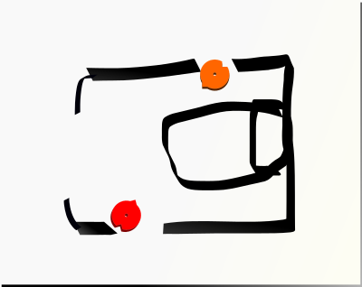
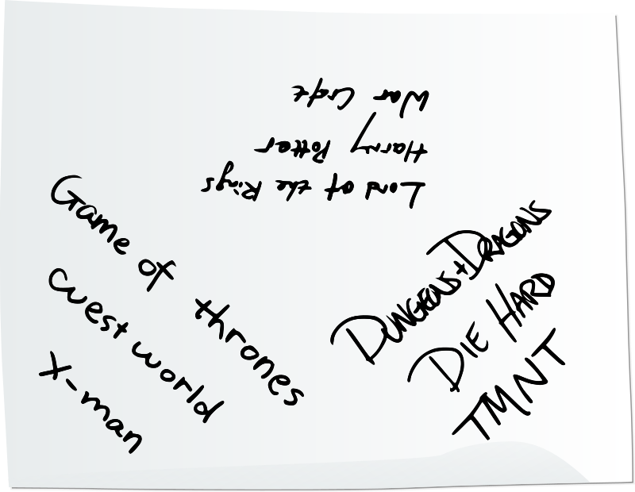
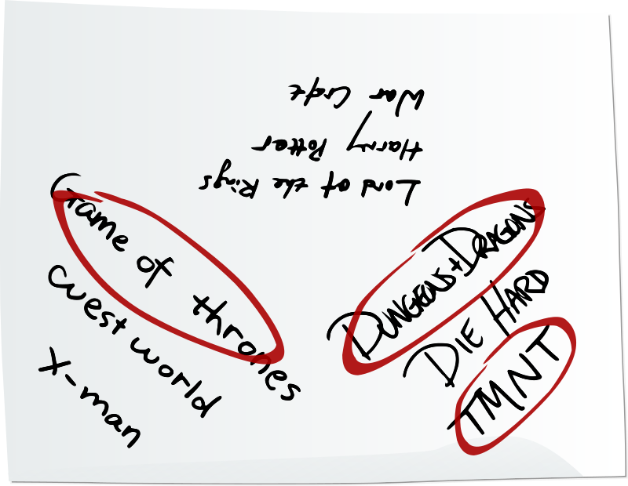
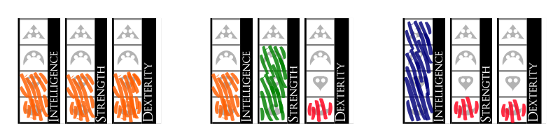

# GM Guide

This guide is intended for a Deckahedron World Game Master (GM).

Read this guide if you are the volunteer among your friends to run the
game. Your responsibilities are:

 * pitch the idea of playing Deckahedron World to your friends
 * know, teach, and follow the rules
 * give Non-Player Characters (NPCs) names, voices, motivations,
   and behaviour
 * describe scenes
 * confront the players with challenges and dangers
 * move the story to plot points
 * take some notes
 * and...

The last responsibility is so important it deserves its own paragraph:

The players will signal the *kinds* of fun they want to have. It is
your responsibility to notice these signals and insert that kind of
fun into the game.

---

To make your job of teaching the rules easier, this guide has
**scripts**. The scripts are written to be read by you to the players
at the table.

Before sitting down with your group of players, you should read all
the rules. Your players will have questions, you will need to answer them.

## Show, Don't Tell

One piece of advice frequently given to anyone trying to convey information
is "Show, don't tell".

In that spirit, you are invited to visit
`https://www.deckahedron.com/world/examples`. There, you will see examples
of Deckahedron World being played. For all the author's attempt to make this
document clear, brief, and unambiguous, those examples may do a better job
of conveying just what Deckahedron World is and how it is played.

# First-time Players

If there is a player at the table who has never played Deckahedron
World before, read the Start Script and play Sarukkan's Chamber.

## Start Script

> Hi everyone! We're going to play Deckahedron World.  This is going
> to be really fun, I'm glad you could join me for this!  I'm reading
> directly from a script that was designed to get us started fast, by
> going over just enough of the rules for our first session, so please
> pay attention now so we can get to the fun of the game quickly!
> 
> Deckahedron World is a *narrative* game.
> 
> It's a storytelling game where we all collaborate and tell the story
> together.
> 
> I'm going to be the GM (it's short for Game Master), so I'm going
> to be responsible for the events in the world and the side characters
> (they're called NPCs or Non-Player Characters).
> 
> Each one of you is going to play a role, kind of like an actor does.
> You're going to control one character. You get to tell us everything
> they think and everything that they say and everything that they do.
> 
> Imagine we're making an awesome adventure movie with swords and magic.
> You're the actors just making stuff up as you go, and I'm a combination
> of director and cinematographer, trying to fill the story with excitement
> and drama and also deciding how the scenes go together and where the
> camera cuts to next.
> 
> But let me pause for a minute and get specific about what I mean by
> "you decide everything your character *does*".
>
> You can't just say "My character Tyrion runs up to the bad guy and
> punches him in the head and his head goes flying off".
> You *can* say "My character runs up to the bad guy and *tries* to punch
> his head hard enough to send it flying off". See the difference? When you
> describe an action where there's some uncertainty like that, It's my job
> as the GM to say you've *triggered a move*. The game rules will then answer
> the question "does it happen?" and tell us if the bad guy's head actually
> goes flying off.
>
> When a *move is triggered*, it's time to use the cards and dice to see
> what happens next. Triggering moves is a lot of fun. It's fun to succeed
> and it's fun to fail, because even in failure, new exciting stuff starts
> happening. When you trigger moves, you impact the narrative, consequences
> happen, and we're all going to get surprises when cards flip and dice roll.
>
> Besides face-punching, some other questions that might be answered by
> triggering moves are:
>
>  * Will the washer-woman agree to hide me from my pursuers?
>  * Do I see the giant spider web in my path?
>  * Is there another way out of this burning tavern?
>  * Will this magical scepter work just one more time?
>
> The game isn't all triggering moves though.

Distribute a character sheet to each player.

> Most of this game is talking. That's why "Say Stuff" is written so boldly
> on the character sheets. I'm going to be asking you questions, you'll
> probably have lots of questions for me, and we're going to put everything
> together to make an epic story. It's gonna have adventure, battles, chases,
> discoveries, and magic.
>
> It's a fantasy story, so think dangerous, and take risks.
>
> Be true to your character's personality. Remember it's sort of like acting.
>
> Your character will start out as a scrappy adventurer, and rise in power
> to become a hero. Or villain. Or maybe they'll just die in the attempt.
> And maybe they'll be resurrected after that.
> 
> Each session will be about 3 hours.  We might spend a long time bouncing
> ideas off one another and dealing with each consequence in an
> improvisational way, or we might engage in a long battle with lots of dice
> rolling and card flipping.
> 
> There's no predetermined story, we're all in this together, and we're
> going to play to find out what happens.
> 
> This first session will need about 40 minutes of preparation, though.
> Ten minutes has already gone by with this speech (it's almost over).
>
> Next, we're going to play Sarrukan's Chamber, a pre-made adventure for
> you to get the hang of the rules. It will be short. I'll set a timer
> for 10 minutes and end Sarukkan's Chamber when it goes off.
>
> Then we'll take 10 minutes to create a Touchstone List for our game.
>
> Then we'll do 10 minutes of Character Creation.
>
> And then, the adventure begins.
>
> Let's start!

## Your Deckahedron

Give each player a Deckahedron.

> Here's a stack of 20 cards, it's called a Deckahedron.
> Notice the 4 different colored symbols on the edges.  They're named
> Anchor (red), Bulb (yellow), Crescent (green), and Dart (blue).
> When you *trigger a move*, I'm going to instruct you to flip the top
> card of your Deckahedron, and we'll see the result on the flipped-over
> side. There are 4 possible results:
>
> * ✔✔ : this means you succeed at the thing you tried
> * ✔ : this usually means something good happens, but maybe with a downside
> * ✗ : this usually means something "ok", or not-so-good happens
> * ✗✗ : this usually means that I get to say what happens and make my own move
>
> When I ask you to flip, I'm going to say something like "flip Anchors"
> or "flip red" or "flip green". That means you find the result
> on the edge that has that color or symbol.
> 
> When you flip it over, please put it down in a way that I can clearly see
> the result. Try to orient your cards consistently so that I don't get
> confused about what your result is.
> 
> Let's try it: everybody put your Deckahedron on the table and flip yellow.

Step the players through "flipping yellow" using the instructions in the
[Player's Guide](mod_deckahedron_world.md)

Make sure each player understands how to execute a flip before you proceed.

## Your base moves

Give each player a Move Booklet

> Here are the basic moves.  You don't have to read this booklet unless you
> want to. I'll point out moves when they're triggered and we can read them
> together or you can just let me apply them.
> 
> It's hard for me to do everything though, so the more you can help me out,
> the smoother the game will run.
> 
> The move you'll be triggering the most will probably be Defy Danger, that's
> why it's on the first page. The moves in the back of the booklet are
> "downtime" moves which we won't need until much later.

## Sarukkan's Chamber

First, you will need names for the characters and setting of Sarukkan's
Chamber. Ask the players these 3 questions. This is an improvisation exercise.
Its purpose is to get the creative juices flowing and to signal to the
players that they have input over the story.

Ask the players for the name of a medieval fantasy city name.
Simply write down the answer. That will be the name of the setting.

Ask "What's a store where women buy clothing?". This time, twist the answer
a little to create the female protagonist's name. (eg, "Forever 21" might
turn into "Forva", "The Gap" into "Gappalina")

Ask "What's a city in Europe?". Again, twist this answer to create the male
protagonist's name with that. Stretch your creativity muscles.
(eg, "Paris" might turn into "Croissant", Maybe rearrange "London"
to "Donalo")

    This mini-game is a GM tool. Often, the players will look to you to
    come up with names of characters or places on the fly. Instead of
    sitting still and thinking for 30 seconds, you can can use this technique
    to keep them engaged. See [Appendix 1](#appendix-1) for more

Ask each player to write down the names you just came up with on their
character sheet.

Next, instruct the players to fill out the attribute boxes on their
character sheet like so:

 * Both characters have 1 Intelligence (Anchor)
 * The female protagonist has 3 Dexterity (Crescent) and 2 Strength (Bulb)
 * The male protagonist has 2 Dexterity (Bulb) and 3 Strength (Crescent)

### Introduce Sarrukan's Chamber

Begin narrating the set-up.

> [Addressing her]
> _ (female protagonist), you are an acrobat.
> Your troupe of performers set off on the road to perform in the big
> city _ (city name). You were really excited, because your big brother lives
> there, and you haven't seen him since you were 13, and that was 10 years
> ago.
> 
> But your excitement soon turned to horror and despair. On the road, your
> troupe was overrun by masked horsemen. They attacked fiercely and without
> mercy. All the women of the caravan were captured, and by the cries and
> what you glimpsed through your stained blindfold, all the men were slain.
> 
> You remember one phrase uttered by the marauders,
> "Deliver them to Sarrukan."
> 
> After days of travel shackled in a box, you found yourself imprisoned in
> a small, dark, musty cellar room. Windowless, the only illumination is
> whatever lamplight filters through the cracks of the door.
> 
> [Dramatic pause]
> 
> [Addressing him]
> _ (male protagonist) you are a thief-catcher.
> You're not too bright, but your boss, Gandlin, has taken you under his
> wing and taught you street wisdom. Merchants employ him to recover stolen
> valuables or they pay for simple retribution against the pilfering
> scoundrels. You provide the muscle. Gandlin sniffs them out, you beat
> them up, and each shares in the reward.
> 
> That's how it had been. Gandlin has now gone missing.
> 
> He was investigating a series of thefts from
> private homes. There was some pattern to it -- artifacts or books taken,
> but no smashed windows or doors. The mystery of it had Gandlin
> obsessed, working sometimes until dawn.
> 
> Then one dawn it was he that was taken, with a trail of blood to
> tell of it. Following the path, you came to the locked gate to the yard
> behind Sarrukan's estate. Sarrukan was a powerful player in _ 's (city name)
> noble circles, but not much was known of him.
> 
> After jumping the wall, you didn't get much farther before you were
> surprised from behind and knocked out, waking up in a tiny, dirt-floored
> room in the cellar.
> 
> [Addressing both]
> But tonight, something changed. It was noisy tonight. Footsteps and
> conversations could be heard upstairs. It was some kind of party.
> And there were no guard patrols of the cellars. In parallel, but
> without bumping into each other, you both used the lapse to escape.
> 
> You freed yourself from your cell.
> 
> In some dark corner you grabbed a reveler and took their elaborate
> costume and mask for a disguise. Tonight must be a masquerade ball.
> 
> With no easy opportunity to exit, you kept evading attention by going
> upstairs, until you reached the third floor.
> 
> From different doors, you simultaneously enter an empty bedchamber.

At this point, take out a blank sheet of paper and draw this
incomplete map of Sarrukan's Chamber. Then drop a couple tokens
representing the players' characters on the paper. If you don't have
tokens, you can use coins or nuts or glass beads, anything handy.

{ width=7cm }

This map will let everyone know roughly where their character is
positioned. You don't always need this visual aid, but Sarukkan's
Chamber is a tutorial, so it's good to have some practice.

When you draw out a map of an environment like this, be very loose
and fast. Leave blanks. Rely on the imagination of the players to
fill in the details unless there's something whose position is important
to draw.

For example, a player might tell you that they look around the chamber for
an exit, and you might say "There's a large window at the front of
the room , but it's framed in iron. The ironwork looks old though, maybe
it's no longer sturdy?". That would be a good point to draw a few lines
to show where the window is in the room.

> You turn from the door you carefully and silently closed to see across
> the room, an apparent party guest in full wardrobe.
> 
> [Dramatic pause]
> 
> One last thing, with these masks on, you don't know this, but you're
> brother and sister.
> 
> What do you do?

Start a timer for 10 minutes.

This last question "What do you do?" is very important.

When you describe a situation, always end with this kind of prompt. Portray
a situation that demands a response. Always.

## But now what should I say?

> Where's the *rest* of the script?

If this is your first time being a GM, you might feel intimidated. That's
ok. Remember, this is not high art, this is improv. You are *playing* to
find out what happens.

If this is the first time you've GMed a game, the best thing you can do
is prepare.  Read the [Guidance](#guidance) chapter. Check out some
[examples](#show-dont-tell) of how other GMs have run their games.
Then, with that context, read the Guidance chapter again.

The primary thing to remember is that on ✗✗, you get to make a move.

Always **Describe the immediate situation around the characters**. This
is how you start a session, how you get things rolling after a snack break,
get back on track after a great joke: tell them what the situation is in
concrete terms.

Use detail and *senses* to draw them in. The situation isn't just an orc
charging you, it's an orc painted in blood swinging a hammer and yelling
bloody murder. You can leverage a lack of information, too. The sound of
clattering armor and shuffling feet, for instance.

The situation around the players is rarely "everything's great, nothing to
worry about". They're adventurers going on adventures -- give them something
to react to.

### Sarukkan's Chamber Details - take them or leave them

 * Luxurious canopy bed in the middle
 * Chamber is full of esoterica - bookcases and desks overflowing with books,
   sculptures, candlesticks, and votives
 * Chamber is empty of any adornments, the only feature is a bed and
   a precise circle of white powder in the center of the room
 * A window at the front of the room - an escape route?
 * An alarm triggers when a guard enters the room?
 * A creepy portrait of Sarukkan, whose eyes follow you as you move
 * A trap-door under the bed - where does it lead?

### Goals for Sarrukan's Chamber

Ideally, Sarukkan's Chamber should demonstrate what kind of game
Deckahedron World is.

Deckahedron World creates plot questions for players to answer:

 * Will the brother & sister who haven't seen each other in a
   decade discover each other's identities?
 * Will the brother & sister escape Sarukkan's imprisonment?
 * (3rd player variant) Will the reluctant guard choose to obey an
   evil master, or rebel?

Deckahedron World creates tension and action:

 * Potential combat against guards or kitchen staff or Sarukkan himself
 * Potential chases involving outsmarting or outmaneuvering pursuers
 * Potential to hatch plans and use available resources to set traps or
   defy traps that been set for them
 * Potential to use stealth and social manipulation with guards and
   party guests

Your group's playing of Sarrukan's Chamber doesn't have to *all of this*,
just give players a taste.

It should also help teach the rules of Deckahedron World.

 * Get each player to have an opportunity to do a Deckahedron flip
 * If a player flips the Critical Success card, that's an opportunity
   to explain the Critical Flip move
 * Ideally there will be a combat scene.
   (see the [Combat guidelines](#creating-a-combat-encounter))
   Try to get the PCs to attempt *Hack & Slash* or *Volley*
 * The brother & sister may trigger *Discern* and *I Know This* moves
   when they try to reveal each others' identities
 * The *Discern* move often comes up when having a look around Sarukkan's
   Chamber itself.
 * If any player-versus-player combat happens, remember to use the PvP
   combat rules

It should also be a warm-up for your GM skills.

 * Remember: "Yes, and..."
 * Move the spotlight - be fair, let all players impact the narrative
 * Manage the pace. Let the PCs have some dialogue, but when it feels like
   they're hesitating, push quickly to the approaching dangers.
 * Get the guards into the room for a quick fight.
 * As the PCs gain the upper hand, show signs of another threat (maybe
   the wizard himself approaches - it's ok to tell the story of what's
   happening *off-camera*)
 * Play Sarukkan's Chamber *honestly*. Set the stakes the same as you would
   when you play a campaign

After Sarukkan's Chamber, the players should now understand how the
Deckahedron works with character attributes to produce results that affect
the narrative. Ask the players if they get it, and explain again if there's
still any confusion.

### After the timer goes off

When the 10 minute timer goes off, you have a choice.

Take a look at your friends, are they having fun? Are they smiling, are they
looking at you eagerly to see what happens next, are they bantering with
each other about what actions to take, are they having in-character dialogues?

Sarukkan's Chamber is intended as a 10 minute tutorial, but if it seems like
everyone wants more, you can keep it going.

Ask the table if they want to keep going with this scenario. If not, just
skip forward to the Touchstone List. But if they do want to continue, add in
the next layer of rules before jumping back into the action.

 * Tell the players how the Speed / Wealth / Pack rules work.
 * Give them each 6 S/W/E tokens.
 * The characters do not get to put any tokens in Wealth or Pack,
   as they were just prisoners
 * Any character still wearing their elaborate costume should get a card
   entitled "Costume", and one token should be put on the card
 * If the characters have any significant items during their
   adventure so far, make a card for that and if the item is heavy or
   unwieldy, put a token on it

### Sarrukan's Chamber 3rd PC variant - The reluctant guard

If you've got a 3rd player at the table, add a guard character.

Add another 5 minutes to the timer, so now Sarukkan's Chamber will end
after 15 minutes, not 10.

Ask "What's a domestic brand of beer?". Use that to create the 3rd
character's name. The guard can be any gender, has 3 Int, 2 Str, and 1 Dex.

Let them know that they'll get introduced about 5 minutes into the story.

After the first two PCs have had a chance to inspect their
surroundings, and maybe have a dialogue with each other, introduce the
3rd PC

> [Addressing guard]
> _ (guard), you are a guard.
> You're the newest hire in Sarukkan's staff, but you're already thinking of
> finding different work. There's some sketchy stuff going on here. You're
> not too sure what exactly, since you mostly patrol the yard, but you're
> sure you heard the sounds of women crying when you patrolled near the
> cellar door a couple days ago.
>
> You got called into the house just now.  Apparently a guest of the ball
> had been assaulted and stripped of their clothing.  The culprit might still
> be inside, so Yogran the Rat, a high-ranking guard, pulled you from valet
> duty to help him investigate.
>
> As you climb to the top of the service stairs, arriving at the 3rd floor,
> Yogran orders you to peek your head into the chamber.
>
> You've heard the rumors, Sarukkan cloisters himself away in there,
> experimenting with dark magic.  Some say, communing with the dead.
> All staff are forbidden to enter his chamber, many agree a curse will
> befall anyone that does.
>
> What do you do?

# Guidance

Here are 5 gems to come back to whenever you don't know what to say next.

 * Portray a fantastic world
 * Fill the characters' lives with adventure
 * Ask the players
 * Refer to your moves for ideas
 * Drive towards your next point in the *Good Bank*

Firstly, **portray a fantastic world**. Deckahedron World is about
characters who have decided to take up an adventure in the hopes of some
glorious reward. It's your job to participate in that by showing the
players a world in which their characters can find that adventure. Without
the player characters in the world, calamity would ruin something precious.
Maybe even the whole world would fall into chaos or destruction -- it might
still even with them.  It's up to you to portray the fantastic elements of
that world. Show the players the wonders of the world they're in and
encourage them to react to it.

**Filling the characters' lives with adventure** means working with the
players to create a world that's engaging and dynamic. Adventurers are
always caught up in some dangerous situation or another -- encourage and
foster that kind of action in the game.

Deckahedron World adventures **never** presume player actions. A Deckahedron
World adventure portrays a setting in motion -- someplace significant with
creatures big and small pursuing their own goals. As the players come into
conflict with that setting and its denizens, action is inevitable. You’ll
honestly portray the repercussions of that action.

Deckahedron World is a conversation. The GM is the main storyteller, but not
the only storyteller. **Ask the players questions** and use the answers.
Embrace your curiosity.

The easiest question to use is "What do you do?". Whenever you make a GM move,
end with "What do you do?". You don't even have to ask the person you made
the move against. Take that chance to shift focus elsewhere.

The questions that gave the characters flesh during character creation are
examples of asking questions and using the answers. You can always revisit
and pull more buckets up from that well. If a character is religious, ask
them what their gods would have to say. If there's a halfling in the party,
ask how hungry the current scene makes them.

The GM may ask the players to describe outcomes. For example, if a player's
character is in a fight with a goblin and the player rolls *attack power*
of 10, the GM might ask the player to "Describe how your character kills
the goblin". This gives the player license to get flowery and really see
their character live up to the promise of being powerful in this fantasy
world.

Other questions to ask are [improv game questions](#appendix-1).
These are questions that have nothing to do with the current scene, but
prompt everyone, especially you, to *think laterally*. These can be great
to inspire you:

 * If you just need a name for an NPC or location
 * If you want to insert a danger into a scene
 * If you want an NPC to respond, but don't have dialogue, voice, or
   personality ready
 * If you need an idea for a puzzle or a monster

`TODO example with improv question and Sarukkan's chamber`

`TODO`

### Move the spotlight

`TODO`

The general attention of people sitting at the table is called "the
spotlight". People tend to talk one-at-a-time, while all others wait in
excited anticipation.

The GM is tasked with managing the "when" of the spotlight. When does one
player's contribution end, and the next player's begin? When has a player
said something that triggers a move? When is it time for the players to all
sit back and suffer or delight as the GM describes the consequences of
their decisions?

Never let a player's time in the spotlight be inconsequential. A player
might wait 10 minutes for their friends' moves, so if their whole turn in the
spotlight ends with "nothing happens" this game will be very unfun.
Give them an opportunity for something. This doesn't mean they have to slay
a demon on every turn, merely getting a big laugh can be "something".

Remember, this is a collaborative story.  Laughter and excitement
are the rewards for everyone.

Allow the players to naturally move the spotlight among themselves.

As the GM, you may take a turn in the spotlight:

 * when someone flips ✗✗ (or sometimes just ✗)
 * as specifically instructed by a move a player is executing
 * when everyone looks to you to see what happens
 * when the players give you a golden opportunity

Usually your turn in the spotlight will be spent making a **GM move**.
But it may also just be general narration.

## Make GM Moves

Often the players will move the story forward by having their characters
talk and do actions that are certain (you don't call for flips unless actions
or consequences are uncertain), so there may be long stretches where a GM
doesn't need to jump in.

 * Use a monster, danger, or location move
 * Reveal an unwelcome truth
 * Show signs of an approaching threat
 * Deal damage
 * Use up their resources
 * Turn their move back on them
 * Separate them
 * Give an opportunity that fits a player's cards or character's background
 * Show a downside to their appearance, reputation, or equipment
 * Put someone in a spot
 * Offer an opportunity, with or without cost
 * Tell them the requirements or consequences and ask

If a player resolves a flip with the *critical failure* card, the GM may use
1 point from the *Bad Bank* to make an additional move.

During the execution of a GM move, tools may be employed to generate ideas
and make decisions:

 * Ask players questions
 * Ask players to reveal a card from their Deckahedron (this doesn't count
   as a flip, this is just the GM using randomness to help make a decision)
 * Put on some music
 * Use an improv game

Try to keep up the excitement and pace of play with your GM moves, but also
know that it's ok to invest a little in making them significant and to pause
for a second to think through some repercussions. Will the move you make
drive the story toward your next point in the *Good Bank*?

Note that the move you execute in play may actually overlap multiple moves
on this list. That's ok, creating honest fictional responses sometimes
demands it. For example, "deal damage" is a move, but other moves may include
damage as well.

### A GM move is not restricted to the player move that caused it

Understand that when a player resolves a flip with ✗✗, that doesn't always
mean that the thing they were attempting fails.

The GM is free to let the character accomplish the thing, but may use the
flip result to bring new action and intrigue into the story.

Let's say a player's character is a thief infiltrating a stronghold, hired
to steal a fabled yellow amulet. Maybe the character attempts to climb over
a wall to avoid being seen by guards. Consider the following consequences
of an ✗✗:

 * You fail to get over in time and the guards start yelling and pulling at
   your boots
   (Use a monster, danger, or location move)
 * You climb over, but as you do so, you overhear the guards in friendly
   conversation with someone that sounds a lot like the fence that hired you
   for this caper
   (Reveal an unwelcome truth)
 * You climb over. You pause for a second to listen for the guards' passing.
   You hear their footsteps slow, then stop. Have they found something?
   Suddenly, one barks an order "Get to the tower and sound the alarm. Run!"
   (Show signs of an approaching threat)
 * You climb over. The camera pans up to the dark sky, we see grey feathered
   beasts with the faces of birdlike wolves, the flaps of their wings loud and
   ominous. Each of their tails ends in a glowing yellow shape extremely
   similar to the description of the amulet.
   (Show signs of an approaching threat)

The first example is pretty straightforward, a thing was tried, it
failed, the character suffers the direct consequences.

In the remaining three examples, the character got to the other side of the
wall safely. A fictional cue triggered the move, the mechanisms of the rules
were engaged, and then the GM chose to create new, separate, fictional
badness. The fiction produced by the engaging the rules does not have to be
constrained to the fiction that engaged them.

The last example does something even more strange. It talks about a
disembodied "camera" and portrays a scene to the *players*, but not to the
*characters*. This can be a fun style of play in Deckahedron World, but
it may not please every group because it "breaks immersion". If you
describe the world like a movie, you're asking players to be audience,
not actors.

Always be on the lookout for signals from the players for the kind of fun
they want to have.

### Reveal an unwelcome truth

An unwelcome truth is a fact the players wish wasn't true: that the room's
been trapped, maybe, or that the helpful goblin is actually a spy. Reveal
to the players just how much trouble they're in.

### Show signs of an approaching threat

This is one of your most versatile moves. "Threat" means anything bad
that's on the way. With this move, you just show them that something's
going to happen unless they do something about it.

### Deal damage

When you deal damage, choose one source of damage that's fictionally
threatening a character and apply it. In combat with a lizard man?
It stabs you. Triggered a trap? Rocks fall on you.

The amount of damage is decided by the source. In some cases, this
move might involve trading damage both ways, with the character also
dealing damage.

Most damage is based on a die roll. When a player takes damage, tell
them what to roll. You never need to touch the dice.

`TODO`
 * Stamina/Harm/Wound damage
 * Damage their weapons and armour

### Use up their resources

Surviving in dangerous places often comes down to supplies. With this
move, something happens to use up some resource: weapons, armor, magical
item charges, ongoing magical effects. You don’t always have to use it
up permanently.

A sword might be flung to the other side of the room, crossing
the shimmering barrier might end any ongoing magic effects, etc.

`TODO`
 * Wealth / Pack
 * Player loses confidence in the skill they just tried.  Put a white-side
   red card on it until they use it and flip a ✔ or ✔✔

### Turn Their Move Back On Them

Think about the benefits a move might grant a character and turn them around
in a negative way. Alternately, grant the same advantage to someone who has
it out for the characters.

If Ivy has learned of Duke Horst's men approaching from the east, maybe a
scout has spotted her, too.

### Separate Them

There are few things worse than being in the middle of a raging battle with
blood-thirsty owlbears on all sides -- one of those things is being in the
middle of that battle with no one at your back.

Separating the characters can mean anything from being pushed apart in the
heat of battle to being teleported to the far end of the dungeon. Whatever
way it occurs, it's bound to cause problems.

### Give an opportunity that fits a player's cards or character's background

Every character has unique move cards for skills that they shine at, or has a
fictional backstory that can overcome social obstacles or tests of knowledge.

Present an opportunity that plays into one character's domain.

It doesn't have to be a character that's in the current scene though.
Sometimes a locked door stands between you and treasure and there's no
lockpicking expert in sight. This is an invitation for invention, bargaining,
and creativity.

Traps, ambushes, and locked doors are great examples.
Need some Derring-Do to avoid giant clock-tower gears?
Maybe proof of religious or guild affiliation would confer a backstage pass?

### Show a downside to their appearance, reputation, or equipment

Just as every character shines, they all have their unique weaknesses too. Do
orcs have a special thirst for elven blood? Is an ongoing flow of magic
disturbing dangerous forces? The torch that lights the way also draws
attention from eyes in the dark.

### Offer an opportunity, with or without cost

Show them something they want: riches, power, glory. If you want, you can
associate some cost with it too, of course.

Remember to lead with the fiction. You don't say, "This area isn't dangerous
so you can make camp here, if you're willing to take the time." You make it
a solid fictional thing and say, "Helferth's blessings still hang around the
shattered altar. It's a safe area to rest or plan, but the chanting from the
ritual chamber is getting louder. What do you do?"

### Put someone in a spot

A spot is someplace where a character needs to make tough choices. Put them,
or something they care about, in the path of destruction. The harder the choice,
the tougher the spot.

### Tell the requirements or consequences and ask

"Ok, everyone flees from the hammer-camels, heading towards the water, but
let me ask this first: Samwise is wearing plate armour. If he leaves it
behind on the bank of the river, will someone else provide a distraction so
he can remove it? Or Samwise can keep it on and clumsily swim, but he will
lose 1 Stamina."

This move is particularly good when they want something that's not covered
by a player move, or they've failed a move. They can do it, sure, but they'll
have to pay the price. Or, they can do it, but there will be consequences.

Base the requirements or consequences in the fiction and make them clear
to the characters, not just the players.

This can also be a good move to underscore particularly tricky dangers. Let
the players know that if they attempt to dive between the giant clockwork
gears, you're going to spend points from the *Bad Bank* to increase the
difficulty.

# Begin a Campaign

## Establish Touchstones

First, the table needs to get on the same page about the adventure's setting,
themes, and tone. Give the players an overview of the steps in creating a
Touchstone List, and tell them its purpose. Then start executing the steps.

Take out a new blank sheet of player.

> Before we start an adventure, we need to figure out what kind of world
> your characters come from.
>
> We'll go through a 3-step process to make what's called a Touchstone List.
>
> The Touchstone List is a tool we use to create the setting for the
> game. I'll also use it for inspiration on tones and themes. And we'll look
> to it together when your characters are pushing the envelope, to answer
> questions like "is that action even possible?"

### Step 1 - Brainstorm Titles

> The first step is for everyone to grab a pen or pencil and write a few titles
> from pop culture on this piece of paper. Think of books, movies, games,
> comics and TV shows whose settings inspire your imagination. Think of ones
> where you've imagined yourself inside those stories and thought about what
> decisions you would have made if you were those characters.
> 
> Don't censor yourself, and don't shoot down anyone else's title down. This
> is brainstorming, and we want the ideas to flow.
> 
> Stop when you've got 3 or 4.

You may need to reiterate to the players that you're looking for *titles*.

{ width=7cm }

### Step 2 - Narrow Titles

Take a look through the titles for anything that may be in a setting that's
not well-supported by the rules of Deckahedron World. If there is such a
setting, remind the players that Deckahedron World has rules for swords and
limited magic, and no rules for machine guns or interstellar travel. So
choosing sci-fi touchstones might help with themes and tone, but won't have
much to offer for establishing setting.

Deckahedron World works best with stories where characters start out
"scrappy", that is to say, without extraordinary powers and privileges,
characters who struggle, who chafe against their current limitations in the
world. So superhero titles or stories where protagonists are genetically
imbued with special abilities might also need to be pared down.

> For step 2, we're going to narrow it down.
>
> Take a turn and circle one of the titles on this list. You are allowed to
> circle one of your own titles, or any of the other ones.
>
> Only circle one, and don't circle something that's already been circled

Each player gets a chance to circle one of the titles on the list.
The GM gets a turn too, and should take that turn after the others are
finished.

{ width=7cm }

### Step 3 - Set Expectations

> This is our "Touchstone List": [read the circled titles]

The GM, using their knowledge of the rules, should read the list and
call out any potential conflicts between circled titles and the rules of
Deckahedron World.

Will the players expect their characters to pull off the same feats
and use the same powers of the chosen touchstones?

*Die Hard* is a great touchstone for tone, themes, and relationships, but
Deckahedron World doesn't have rules for helicopters or machine guns.

The GM should not *reject* any circled titles, they should just address
what's going to be possible.

Everyone will have more fun if expectations are set at the beginning.

> Imagine this mashed-up universe.
>
> What kind of world would be the one where some portion from each circled
> title is mixed together with the others?
>
> What does this world look like?
>
> What are it's dominant features?
>
> What secrets are hidden away in the small places?
>
> Who are the folk that populate it, do their children happily play in the sun?
>
> What monsters lurk, what weakness do the ambitious and powerful exploit?

It's not necessary for anyone to answer these questions, they are mostly to
provoke the imagination. But if the table does start imagining out-loud, keep
that discussion going for as long as it is productive.

### Using The Touchstone List

The "Touchstone List" may be consulted when the table needs to make a
judgment about whether facts being proposed make sense in the shared universe
you're creating. It can also be used to simply make calls on whether a
character's attempt at something is uncertain (remember, the GM
only calls for flips when the outcome is uncertain).

You can ask the question "Did any character accomplish a similar feat
in _ ?" (fill in the name of one of the titles in your Touchstone List).

It's also something to consult for what's *not* special. If the titles on your
list never talk about how their heroes acquire horses or boats, and instead
just spontaneously present the characters on horseback or sailing at sea,
then maybe your game should gloss over questions like "How did you get
that horse?".

The Touchstone List is also an early way that the players can signal
to the GM the kind of fun they want to have.

## Character Creation

### Create a GM sheet

The GM needs a sheet of paper to make notes and track information.

At the top of the sheet write the headings "Good Bank" and "Bad Bank".
Leave enough space to track the points under each of those headings.

### Set Expectations

> Deckahedron World is a game about a group of scrappy adventurers who
> grow in power as we play the game.
>
> Your character will start the game with skills and gifts beyond ordinary
> folk, but they'll still have to work and struggle through adversity to
> become really powerful.

### Choose cards

Gather the move cards, and separate them into piles:

 * Cards with "A" in the corner
 * Cards with "B" in the corner
 * Cards with "C" in the corner
 * Cards without any letter in the corner

#### If any player is new to Deckahedron World

Lay out the A cards in front of your players.
Then select and lay out 4 B cards.
Then select and lay out 4 C cards.

> These are called move cards. You are going to take turns choosing, and
> I'm here to explain how they work and answer questions.
>
> The "A" cards are usually the most powerful, so, during character creation,
> you can only choose one of those. You can choose up to 2 of the B cards,
> and if you wanted, you can choose 3 C cards, You get to start with 3 move
> cards in total.
>
> To differentiate the characters, you don't get to choose a card that
> someone else has already picked. But later on in the game, you'll have
> opportunities to learn new moves and even choose moves that someone
> else has.
>
> There's a lot of choices here, so don't get overwhelmed. You don't have
> to read all of the instructions on each card, just focus on the titles
> and ask yourself if that sounds like something you want your character
> to be doing during the game. If a title sounds interesting to you, ask
> me about it and I'll explain how it works in the game.
>
> If you're the kind of person that really wants to optimize your character
> you'll probably want to read and understand the rules in the Player's Guide,
> plus all the text of the move cards, and now might not be the best time
> for that. Deckahedron World is more about improvisation than perfection,
> so try to listen to your gut and just pick cards that look like fun.

As players choose cards, there may be opportunities to explain some of the
deeper rules.

When a player chooses a card with an UNENCUMBERED or RECEIVE CARDS tag,
take that opportunity to explain how Speed / Wealth / Pack works
and point out how it will impact their ability to choose other equipment
and be able to run away from threats.

When a player chooses a card with an IMMEDIATE tag, take that opportunity
to explain that they can only use one IMMEDIATE move at a time, and that
they don't risk a GM move if they flip ✗ or ✗✗.

#### If every player has played Deckahedron World before

For experienced players, moves are chosen by drafting cards.

Shuffle the A, B, and C piles, keeping them separate.

Put the B pile on top of the A pile, then put the C pile on top of that,
creating a deck. Take that deck in your hand. Don't shuffle it.

Deal out a hand of cards for each player at the table. Some players might
get more cards than others, that's ok -- there doesn't need to be the same
number of cards in each hand.

Now the draft begins. Each player should look through their hand, take
one card from it, then pass the remaining cards to the player on their left.
They can take at most 1 A card, and at most 2 B cards.

They do that 3 times.

Any amount of table-talk is allowed during the draft.
After the draft is over, if someone doesn't have an A card, they may
additionally choose any C card that wasn't chosen in the draft.

### Name your character

When players have finished picking cards, ask them what their character
is called. Have them write the name on the top of their character sheet
bold and large so that you can read it. Using a felt-tipped marker is
recommended.

### Choose Int / Str / Dex

{ width=7cm }

Tell the players to choose how to distribute 6 points among the attributes.
No attribute may have a rank of zero. They must all be at least Anchors.

Looking at which attributes get applied to their chosen move cards will
help the players decide how to distribute these 6 points.

### Add flesh

As they are choosing cards, ask the questions on this list, one-at-a-time,
and make notes from the players' answers. Don't ask each question to each
player, address a question to just one player, then move on, asking the
next question to the next player. This exercise gets the players thinking
about their characters, and gets the table talking, so it's ok for players
to blurt out responses out of turn.

This conversation might also add details to the world, like
what kinds of species and religions exist.

 * What species is your character, human, or something else
   from our Touchstone List?
 * Does your character steal things, or do they respect the
   concept of private property?
 * Before the adventure starts, is your character engaged in
   any kind of profession?
 * Does your character believe in gods? Is there some kind of
   religious practice or religious organization for them?
 * Does your character enjoy the outdoors, or city life? Are
   they extreme in that preference?
 * Roughly how old is your character?  Have they ever killed
   a person before?
 * What's your character's social standing? When they first
   walk into a room full of people, do they provoke any reaction?

Not everyone will get asked every question, but everyone will
*start thinking* about how *each* of these questions applies to their
character. With some depth and dimensionality in mind, a player will
be better able to imagine creative outcomes to the situations their
character is confronted with.

As you're asking the players these questions, listen for how the answers
signal the kind of fun the players want to have and also measure the
expectations they have for the game. Deckahedron World is a game where
characters start off as scrappy adventures.  If a player is telling you
their character is a fire demon or a ten year old shoe-shine boy or a
computer hacker, a conversation is needed to establish how that character
can fit into the Deckahedron World rules.

If a player's character reads as too exotic, that might be the player
signaling that the fun they want to have is playing a different game.

### Choose Risk Drivers

> Since Deckahedron World is a game about taking risks, I'm going
> to give you an opportunity to get some bonuses when you get risky.
> We're going to create what are called "Risk Driver" cards.
>
> On your Risk Driver will be written some goal for your character to
> achieve in the story. Then I'm going to put 2 green tokens on the card.
>
> When your character *takes a big risk* to achieve this goal, you get
> to take the 2 green tokens.
>
> The player on your left is going to look at this list of goals then
> present you with 2 goals.  You must choose 1 of them. That goal gets
> written on your Risk Driver.

 * Expose an embarrassment
 * Locate a prize
 * Extract a secret
 * Become enamored
 * Sell your services
 * Break down a barrier
 * Choose a side
 * Be an agent of justice
 * Take pity on the desperate
 * Start a grudge
 * Consort with the unsavory
 * Believe an impossible claim
 * Get called out on your boasting

Write the chosen phrase on a blank card and hand it to the player. Place
two green tokens on each player's Risk Driver card. When their character
first *takes a big risk* by the method or for the reason written on their
card, the player takes the tokens.

### Choose Speed / Wealth / Pack

`TODO: illustration`

The rules for Speed / Wealth / Pack will require some stackable tokens,
which can be coins or poker chips if you have some. These will be called
S/W/E tokens throughout this guide.

Give each player 6 S/W/E tokens.

> Here are your Speed / Wealth / Pack tokens. I'll explain how they
> work. To begin, stack all of these up on top of the word "Speed" on
> your character sheet.
>
> [Wait for them to find it]
>
> Your character now "has 6 Speed", which basically means they're not
> carrying anything that would slow them down or trip them up. If they
> need to dive through a window, sprint away from a foe, or move lightly
> through a crowded room, they'll have no problem. As long as your Speed
> is 4 or more, any such maneuvers will be easy.
>
> But when you go below 4 Speed, you start having trouble doing those
> things. Sometimes, like with the move "Bravely Run Away" there's an added
> cost, and other times, like with "Pick Pockets", the move is just
> impossible.
>
> When your character carries weapons, armour, and some other items, you're
> going to take a card with the name of that item on it, take a S/W/E token
> off your Speed stack, and put the token on the card (in the case of armour,
> you might need more than one token).
>
> You'll probably notice the other words next to Speed on your character
> sheet, "Wealth" and "Pack". Tokens placed on these spots can be used
> with the "Good Thing I Brought..." or "Shop / Procure" moves. They're
> not necessary when starting out, but you can have a look at the Player's
> Guide to find out more.

### Choose Items and Weapons

> Now lets give your characters some equipment.
>
> We'll start with the mandatory stuff, does anyone have a Move Card that
> has a "RECEIVE CARDS" tag on it?

Help them identify the tags on their move cards then give them the items
or the choice of items specified in the rules for those cards.

During this phase, as they choose each card, instruct them to move a S/W/E
token from their Speed stack onto the card.

Also, indicate that they get to fill in the blank on the card, so that you
and they know exactly what kind of item the character posesses.

> Next, everyone gets to choose 2 item cards for your character, these can
> be weapons, armour, or any other items that have mechanical significance.
> Deckahedron World comes with some cards to get us started, but we can
> also write stuff on blank cards.
>
> It's recommended that your character have some kind of weapon. Without
> a weapon, their "attack power" will only be 1d2. Here are the weapon cards
> that come with the game, but we can also use blank cards and create
> weapons that would be reasonable for a "scrappy adventurer" to have in
> the universe we've imagined in our Touchstone List.
>
> When your character strikes an enemy with a weapon, their attack power
> is 1d4.  You can increase your attack power later in the game by using
> the "Craft a Weapon" or "\_ Mastery" moves.

Lay out the weapon cards that come with the game. If two players want
the same kind of weapon, just use a blank card to make a second copy.

If a player wants their character to have an unusual weapon, that's fine.
Explain to them that at the beginning of the game the die they will roll
will be a d4, even if they describe something epic.

> The next recommendation is armour or a shield. Armour works by
> absorbing the attack power of your enemies. Shields work by nullifying
> your enemies' attack power, but only if you can get your guard
> up fast enough, and that will challenge your Dexterity.

Lay out the armour and shield cards that come with the game. If two
players want the same kind of weapon, just use a blank card to make a
second copy.

Players don't have to choose only from weapons, armour and shields.
After the cards due players with RECEIVE CARDS tagged cards are chosen,
each player can choose at most 1 magic item card during character creation
as one of their 2 item cards. They can take one even if they didn't choose
the "Use A Magic Item" move card. Make sure the player understands the
difficulty and cost of using "Use A Magic Item" at the "wild" level.

`TODO: link to weapon and armor lists`

> Finally, you may now choose to put any number of tokens you want
> from your Speed stack onto your Pack stack. This Pack stack represents
> the adventuring gear you brought with you. We don't have to actually
> detail the specific contents of your backpack though. Instead, when you
> need some equipment to solve a problem, you will use the "Good Thing I
> Brought..." move, and say what kind of equipment you had with you.
>
> If that equipment is something you return to your backpack after use,
> write it down on a card and move the tokens from your Pack stack onto
> the card. If the equipment gets consumed immediately when you use it,
> the tokens just move back on top of your Speed stack.
>
> Similarly, if you lose an item during your adventuring, you lose the card,
> but the token goes back onto your Speed stack. Tokens move on and off
> your Speed stack as you acquire and drop items.

#### Aside: A feather can make you slower

Often during this phase, a player might bring up the issue of why an item
they've called a ring or a pair of boots reduces the tokens in their Speed
stack. How can sliding on a ring make it harder to run away? How can wearing
boots make it impossible to pick a pocket?

The answer is: that's for them to decide.

In Deckahedron World, there are two arenas: the fiction and the rules.
Playing means flowing between the two arenas. All the players create
fiction, which triggers rules, then the rules produce mechanical results
which the players are challenged to interpret into fiction. Sometimes that
means the GM interprets an attack power roll, and sometimes it means that
a player explains that though their ring looks small, it weighs more than
anyone expects, or that the magical attunement of the boots sends a
tingling sensation up the nerves of the wearer's legs.

The player that writes on the card should already know that it will take
a S/W/E token, so it will be up to them to justify what they wrote.

This doesn't mean that every item reduces your speed. After the adventure
begins, the fiction may produce a letter from the king, or the eggs of a
cursed salamander -- things that can be tracked by writing them on a card,
but that don't require a S/W/E token.

### Home / Comfort

Before the game begins, ask *every* player where their character feels most
at home, or what their favourite activity is -- what they're already good at.

Write down the answers.

Use this information to get your first point in your *Good Bank*, by
starting the story out in a place of normalcy, vitality, and comfort.
Remember, it doesn't have to be a Hobbit hole.  Characters might be most at
home in the middle of a bloody battle.

### Risk Takers

Ask this question to each player: What about your character's personality
causes them to overreach?  What makes them take risks a normal person avoids?
Are they brave, foolhardy, driven, greedy, curious, grieving? Caught between
two worlds? Unsure of who they are? Do they have a deathwish?

Write down the answers.

### How do you meet?

This is a game where the players play together on the same team.

Ask players if the characters already know each other. If so, how?
If not, establish the broad strokes of how they will meet and what will
make them decide to team up.

They should be committed to a shared goal within the first 30 minutes of
play. Some questions to consider:

 * Will it be an uneasy alliance?
 * What are the stakes?
 * If the characters are not natural allies, how will they come to trust
   each other enough to team up?

### Begin

After establishing all the details about the characters, it's time to begin.

There are many ways to start the narration, so check out the
[examples](#show-dont-tell) to see some.

Players will probably have a couple questions on their mind when the game
begins:

 * Where am I?
 * Where can I go?
 * Who else is here that I can interact with?
 * How do I start using my special move cards?

One classic way is to start like some movies start, with an establishing
shot that gives us a sense of setting. You could narrate a typical
day-in-the-life scene of NPCs. Or maybe start with the atypical, and narrate
a scene of trouble brewing.

Another way is to zoom in. Start narrating from a bird's eye view of the
continent, zoom in to a specific region, then to a city or town, then to a
neighborhood, then to a building and ending when you're in the room with
the player's characters.

Everybody at the table has seen movies before, you can use that fact to talk
about "the camera". You can use words like "pan" and "fade in", and everyone
will naturally get it.

End your initial narration by confronting them with a problem and asking
"What do you do?"

---

# Session 1 Rules

---

These rules are split up into sessions. During the first 3-hour session,
the players will probably just be getting the hang of the the flow of the
game. In session 2, they will probably experience downtime, and be ready
to understand how moves interact with each other.

## Filling The *Bad Bank*

When a player flips and *resolves a move* with a ✗, mark a point in
the Bad Bank.

### Calling for flips during a GM move

Sometimes you will be making a GM move and want to use randomness to
decide which direction to take the fiction, and call for a player to
flip a card from their Deckahedron.  This is not considered *resolving
a move* and thus if they get an ✗ as a result, you should *not* mark
a point in your Bad Bank.

# Creating A Combat Encounter

## Balance

Grab a piece of paper and write down the names of each opponent.  Beside
their name, draw ticks for their Stamina points.  Beside that, write their
attack power die (d2, d4, d6, d10).

Opponents' Stamina points should be realistically scaled to the "scrappy
adventurer" level of the players. This table should help.

|                   | Stamina points | Attack power
|-------------------|----------------|-------------
| Dotards, Children | 2              | 1d2
| Civilians         | 4              | 1d2 - 1d4
| Bouncers, Guards  | 5-6            | 1d2 - 1d4
| Trained Soldiers, Elite Guards  | 7-10 | 1d4 - 1d6

Generally, human opponents will have d2 attack power when unarmed and d4
attack power when armed. Save greater attack powers for monsters and special
villains.

### Calculate party power

Party Power is an easy number to calculate, based on each Player Character
(PC) in the scene.

` Party power = (10 ✕ (# of PCs)) + (# of green tokens the PCs have) `

### Create your foes

Create set of enemies that challenge them to the desired degree.

A challenging fight for new players is made by creating foes with Stamina
points equal to the Party Power.

You can also use Party Power to give the foes:

|                                                | Party Power cost
|------------------------------------------------|------------------
| One armor slot that can absorb Harm            | 3
| One armor slot that can absorb Harm or Wound   | 6
| A weapon that does 1d6 damage                  | 4
| One Stamina point beyond the norm              | 1

You can also augment foes by
[spending points from the *Bad Bank*](#using-the-bad-bank).

Sometimes you just want to punctuate the plot with some action by throwing
in a quick-and-easy fight. In that case, use half of the Party Power to create
foes, but put something else in jeopardy (information, resources, social
standing, risk of alarm)

### Give hints

Don't surprise the players *too* much. Always describe the encounter in a
way that hints at the difficulty.

 * The two guards *exchange an unsure look and step forward*
 * The salty pirate flashes his blade, but *simultaneously takes a step
   backwards towards his ship*

 * The golem is *gargantuan and covered in scars from many battles*
 * The *horde* of undead wolves stare at you with *unrelenting hunger*
 * The old man with the walking stick is *unfazed by your threats* and,
   *after looking you up and down, turns away with an air of dismissal*

## The feel of combat

In combat, it's ok if play gets more formulaic.  Some players enjoy
the "abnegation" of a tit-for-tat combat scene that lasts tens of minutes.
This can be a combination of exciting and relaxing.  Give your players
opportunities to press their favourite buttons.

That said, some players don't seek abnegation. What kinds of signals are
your players giving you? Maybe they want to get through combat faster. If
so, when you make your moves, you can think cinematically. Continually raise
the stakes for both sides during the scene. Think dangerous. No character
or set piece needs to be safe or sacred.

## The Combat Spotlight

Combat can play out in whatever way feels natural and follows from the
fiction. That said, it can be taxing on a GM to come up with new, creative
responses in combat because flips are happening frequently. So, to relieve
some of that pressure on the GM, here are some formats available to follow
to get you through a fight scene.

Deckahedron World doesn't have turns, but it's ok if moving the spotlight
during combat makes it feel that way.

#### Format 1

This format is simple, and gives the players the most agency.

  - Give each player a "turn" where they will probably trigger an aggressive
    combat move like Hack & Slash or Volley
  - Pay attention to IMMEDIATE combat moves that may have triggered
  - Execute the moves, make cool stuff happen as consequences
  - Go around the table until all the opponents flee or are incapacitated
  - Any ✗✗ results may usually be interpreted as "your enemies attack". Choose
    some opponents that weren't *just* in a Hack & Slash, and declare they
    attack one of the player's characters. Apply attack power against that
    character. Use an attack power die from one attacker, and add 1 attack
    power for each other attacker

#### Format 2

This format makes the opponents more of a threat.

 * Give each player a "turn" where they will probably trigger an aggressive
   combat move like Hack & Slash or Volley, call that a "player round"
 * Pay attention to IMMEDIATE combat moves that may have triggered
 * After player turns are complete, and the players look to you to see
   what happens next, execute an "NPC round"
 * Identify the opponents that didn't interact during the "player round"
 * Describe how all of those opponents team up on one of the player's
   characters, and call for one Defy Danger flip.
   (move the "danger" spotlight fairly, but also try to put pressure on any
   players with more than 3 green tokens)
 * Failing the Defy Danger flip results in the player's character suffering
   the opponents' attack. You can calculate attack power thusly:
      * ✗✗ : one attack power die from the lead attacker,
        and add 1 attack power (not die) for each other attacker
      * ✗ : no attack power die,
        but 1 attack power per attacker (so 3 foes = 3 attack power)

#### Format 3

This format imagines the opponents as particularly quick and aggressive.

  - Give each player a "turn" where they will trigger a move
  - Pay attention to IMMEDIATE combat moves that may have triggered
  - When describing the outcome of a player's move, also describe how the
    opponents take aggressive action.
  - Keeping the spotlight on that player, have them respond to the actions
    of their foes, usually by needing to follow their first flip with a
    Defy Danger flip.
  - Allow players to avoid the opponent's aggressive action if their first
    flip specifically provided for it, and it makes sense in the narrative.
    (See Backstab, Bum Rush, Volley)

`TODO`
This is just guidelines
You have power - it's mostly in the narrative
What kind of GM move do you do in response to failed flips?

## Loot

After combat, the players may propose that their characters sift through
the battlefield looking for valuables. Let the characters find whatever you
think would be most fun.

Sometimes you don't know what loot is appropriate.

If the characters slay a pack of werewolves, and ask to search the bodies,
and you don't immediately have a great idea about what kind of beneficial
gear could be found on nearly naked bodies, you can write "What we found
on the werewolves" on a blank card, and give it to one of the players.
Tell them to place a token from their SPEED pile on the card.
Later in the game, when the rules demand either a WEALTH or PACK to be
spent, the "What we found on the werewolves" card may be spent, if the
players can justify it.

---

# Session 2 rules

---

## Prepare

*Before* your next session starts, you should run through the events of the
previous session in your head. Think especially about signals you got from the
players. What kind of fun did each player seem to seek out or respond to? Was
a player particularly keen to create backstory, to get into combat, to ask
a lot of questions about how the world works? Can you think of things to go
into the next session to provide that kind of fun?

Think about the plot and how to get your next couple points in the Good Bank.
Do you think the characters will make certain decisions? You might imagine 2
or 3 key decisions the party will be confronted with. For every fork in the
road, try to imagine how the world and NPCs will respond when the characters
choose either branch.

That's important. Prepare for *either* case.

There is no *correct* answer for the characters. Never punish a player for
making a choice you didn't expect.

Being prepared is different than having a plan. No game ever goes according
to a plan. The purpose of preparation is to use your imagination to assemble
a cabinet of narrative spices. Wait until you play to find out what happens.

# Start of Session

## Special Move: The Session Opener

From the second session onward, there is a special move that happens once
everyone has sat down to play.

### Recap Questions

Ask each player for either a thing they learned about the world or a way
they expressed their character's personality. If they can give a reasonably
correct answer, give them a green token.

### Ask for Notes

Lead each player through a quick check-in. Everyone, including the GM will
ask if there's any way they could improve their style of play.

GMs should particularly try to improve their ability to listen for signals.
Tell players about the content you added last session in response
to a signal you got from them. Ask what signals you missed.

### Give Notes

Look at your Touchstone List. Is the group playing the setting and the
themes and tones you all wanted when you started? Use this either to
re-focus player decision-making, or to discard / add titles on your
Touchstone List.

If the players are consistently mis-interpreting a rule or forgetting to
use rules when they have an opportunity, now is the time to call those out
and answer their questions.

#### Frequently Given Note: Create Advantages

New players may especially benefit by being reminded about *creating
advantages* at the beginning of their 2nd session.

After session 1, the players may be realizing that they fail often --
more than they'd like. Take the opportunity to talk about the odds, and
what a player can do to improve them.

Some psychological studies have shown that odds feel "fair" only
when players get wins 60% of the time. Now look at the Deckahedron
statistics reference.  You'll see that if your players are mostly doing
standard flips (flips without advantage), they are likely to feel the game
is unfair.

Explain to your players that getting good at playing Deckahedron World
means *creating advantages*. There are built-in moves like Discern and
Defend that can be used to create advantages. Explain
each one of these moves.  Discern should be particularly encouraged if
you'd like more opportunities to describe the world, environment, and
NPCs that you're creating.

#### Frequently Given Note: Try Wild Moves

When you begin your 3rd session with new players it might be a good time
to remind them that they can literally try any of the moves whose success
is governed by Str/Dex/Int.

Even if they don't have the card, they can trigger a move by describing
their character taking that kind of action.

They might even discover their character is good at it (via a Critical Flip).

Another good hint for your players is that a good time to try moves wild is
when they've built up a +2 advantage.

### Apologia

After running through the events of last session in your mind, you may
realize you're painted into a corner. When the characters are in a
situation where you can't imagine a way to keep the game exciting,
you need to have a conversation with your players.

Retroactively edit.

Collaborate.

Get consent.

# Using the Good Bank

The good bank is used to create certain kinds of "Deus Ex Machina"
situations to benefit the players' characters.

## Create Advantages

One point from the *Good Bank* may be spent to let a player execute a move
as though they had the highest amount of advantage (flip-3-take-best). You
may do this preemptively or after a flip, like a flashback.

Let's say a character encounters two guards who, in an earlier scene,
humiliated and bullied him. The player says their rage takes over and they
launch themselves at both guards, two swords out and slashing through the
air.
With the narrative set-up, the GM thinks it would make the story really
satisfying for the character to succeed. The GM has a few options to push
it in the direction of success.
As a GM, you will usually only have a few points in the *Good Bank*, so
make sure it's worth it.

 * The GM can storytell to resolve the situation. Maybe the guards run away.
   Make sure your storytelling honest for the narrative and is fun for the
   player. It seems like this player has indicated their fun is in the fight.
 * The GM interprets this as a Hack and Slash with Goreography added on
   as an IMMEDIATE move.
      + The GM can hint to the player they already have sufficient narrative
        set-up to Do a Flashback
      + The GM can spend a point from the *Good Bank* to create the advantage

If the last option is chosen, the maximum amount of advantage is given, causing
a flip-3-take-best flip. In this particular situation, the GM must choose
to give advantage to the Hack and Slash move or to the Goreography move.
Even though Goreography has a maximum Move Level of "expert", using a point
from the *Good Bank* always gives you a flip-3-take-best flip.

Here is what the GM can **not** do: the GM cannot tell the player to flip
with an advantage just because they're the GM and they think it makes sense.

If an advantage is to be had, the price must be paid, either by the
GM or by the player.

Creating an advantage by spending a point from the *Good Bank* always
results in a flip-3-take-best flip, even if the character is at the "wild"
level in the move, even if the character is disadvantaged by some previous
situation or effect.

Flipping a wound card on these flips will still override the **Complete
flip rule**.

## An NPC to the Rescue

When the players find themselves in a situation that looks dire:

 * There's no hope and no way out
 * They're surrounded and outnumbered
 * They've lost the majority of their Stamina points and the foes
   in the scene are still healthy and looking to fight
 * There's a puzzle they need to solve, but haven't got a clue

In a dire situation, you can spend a point from the *Good Bank* to have
an allied NPC enter into the scene.

The NPC should be someone (or some thing) the players' characters have met
before and should have an honest reason, based on the fiction, to assist
the players' characters.

As you move the combat spotlight around the scene, the NPC should get a turn
to act as often as each player does.

 * The NPC may use the Defend move
 * The NPC may assist any player character's attack, adding an appropriate
   die to the attack power
 * The NPC may get into a scuffle with one foe, effectively preventing that
   foe from acting as the combat spotlight moves around
 * The NPC may convey or reveal information valuable to the players

## Resurrect a Character

If a player character dies, you may spend a point from the *Good Bank* to
bring them back to life.

You may not resurrect player characters without spending a point from the
*Good Bank*.

Take care to be honest to the fiction. Try not to degrade or insult any
emotional journey that the death provoked.

Resurrection can have many forms.

Resurrection can come at a high cost.

# Using the *Bad Bank*

## Fictional Disadvantages

In real life, some actions are more difficult than others. The GM has some
tools to reflect this in the game.

There are strict rules.  Be realistic *and* work within the boundaries.

Let's say the party of adventurers is in a dark cave at nighttime and
no torches are lit.
A multi-winged bat creature swoops down at them, claws slashing. The first
player declares they're going to dive out of the way (Defy Danger with DEX).
Because of the set-up, it makes sense that this will be more difficult than
if the character could clearly see the creature and the cave floor they're
diving into.

 * You can use 2 points from the *Bad Bank* to create one level of disadvantage

This level of disadvantage should now be applied *consistently* whenever any
character attempts to avoid a swooping attack in a dark environment from a bat
creature without further expenditure from the Bad Bank.

Consistency prevents players from feeling the game is unfair or that you are
especially aiming negative consequences at one player.

## Critical Failures

If a player resolves a flip with the *critical failure* card, the GM may use
1 point from the *Bad Bank* to make an additional move.

## Creating Deadly Combat Encounters

`TODO`

 * Give a foe an extra starting Stamina point - 1 point
 * Increase a foe's attack power die - 2 points
 * Give a foe a spot for a wound - 3 points

## Creating Deadly Pursuits

`TODO`

 * When a player uses the Bravely Run Away move, you can spend 1 point
   from the Bad Bank to land them in a situation where they are again in
   immediate danger

# Creating Challenges for Players

## Puzzles

Puzzles are obstacles that are described as part of the fiction that are
overcome with cleverness. The cleverness can come from the players, by
analyzing the facts of the situation out-of-character, or the cleverness
can come from the characters, by their fictional actions and by using
moves like *Discern* and *I Know This*.

(with thanks to The Art of Game Design by Jesse Schell)

 * Goal - make the goal easy to understand
 * Ramp - make it easy to get started
    * does it look like something they've seen before?
    * does it look attractive & inviting to touch?
 * Progress
    * riddle vs. 20 questions
    * how is progress visible?
 * Parallel
    * can you introduce sub-elements of the puzzle the players can act
      on while their stumped on a larger element?
 * Pyramid
    * pyramids have a point - final challenge
    * do the smaller units build up to a satisfying point?
 * Stumps, Hints, Giveaways
    * if you make a puzzle, you must be prepared for your players to
      be stumped
    * how will hints emerge?
    * giving away the answer still lets players have "Aha!" moments

## Monsters

Monsters are puzzles that can be brute-forced with violence.

### Monsters are part of the fiction

Monsters represent something about the theme, usually the fear that must be
overcome, or the anti-premise.

If a monster is used as the threshold guardian during the [Return](#link)
chapter, it should be a realization of the Big Fear of the story, or the
anti-premise. If the players cross the first threshold on the premise of
"We will save the village", the monster should be the thing that will
destroy the village and many villages after it. If the premise is "We will
return richer than the king", the monster is the thing that destroys the
concept of wealth, maybe by turning the surface of the world into a
hellscape where the only currency is suffering.

### Monsters are puzzles

Get ideas from the [Puzzles](#puzzles) section

Monsters have a weakness or a preferred strategy. For a threshold guardian
monster, the weakness or strategy should demonstrate the *change* integrated
by the heroes.

### Monsters can be fought

Monsters have 1-20 stamina points and 1-5 wound squares

 * 1 Bad Bank point if 11-15 stamina
 * 2 Bad Bank points if 16-20 stamina
 * 1 Bad Bank point for every wound square

Monsters have special attacks

 * The special attacks should be telegraphed somehow
 * 1 Bad Bank point per special attack

### Making monsters

Monsters can be generated by mixing two or more concepts, as long as one
of those concepts invokes fear.

 * big
 * tiny
 * multiple
 * airborne
 * you know it's there, but can't see it
 * seeks out your nostrils, eyes, ears
 * constricting
 * drowning
 * surrounding
 * fire
 * blood
 * amputation / missing parts
 * sharp or thorny
 * fat
 * related to corpses or rot
 * related to excrement or egg-laying
 * signs of disease or infestation
 * evoking mucus or slime
 * ancient
 * brainless
 * beyond comprehension, mind-bending
 * taboo or forbidden
 * wet and against your skin
 * soulless mimicry of human behaviour or appearance
 * drains potency or causes sleep

Any animal, but especially ones humans are instinctively afraid of

 * scorpions, spiders, mosquitos, wasps
 * wolves, jackals, big cats
 * elephants, rhinos, hippos
 * birds, bats
 * crocodiles, alligators
 * snakes, eels, worms
 * cephalopods, jellyfish
 * sharks, killer whales
 * lizards, dinosaurs

For a "classical" effect, mix up two or three of the animals - eg, a snake
with the head of a bird, an octopus with scorpion tails for tentacles.

Some monsters add on an aspect of goodness, nobility, or innocence. This can
emphasize corruption, be used as a trap or a trick, or just create contrast.

 * babies, children
 * gold, wealth
 * sexual attractiveness
 * mimics a character they love / admire
 * religious symbols

Also: bestiaries! See:

 * [Dungeon World](#link)
 * [Hot Springs Island](#link)
 * [Carried by Creatures](https://www.patreon.com/carriedbycreatures/overview)
 * There are others, just search!

## Villains (aka "Bosses", aka "The Big Bad")

Villains have desires. Usually a desire is fundamentally simple (freedom,
revenge, control, love, satiation) but a story is interesting (and provides
more interaction options for the players) if the means to acheive the
desire is complicated.

To get ideas for motivations, you can check out the **Hooks** section in the
[Campaigns Guide](mod_deckahedron_world_campaigns.md).

Think about your villain as a full person. You will have to improvise their
actions and decisions, so use empathy. Decide if they are driven by reason
or if they're irrationaly compulsive. When you know who they are, and how
they make decisions, you will be able to quickly make calls about how they
react to the player-characters' actions.

A good villain often represents a mirror image or "shadow-self" of the
story's heroes, with the thematic difference being that the villain stays
constant, rejecting the change that a hero must accept to truly be a hero.

## 3-way NPC Conflicts

Rock-Paper-Scissors, or 3-virtues-pick-2.

Puzzles that have an unavoidable cost - there's no perfect solution.
Sometimes it's about choosing an imperfect side.

Powerful ways for players to say something about the themes of the story
and the personality of their characters.

[Campaigns](mod_deckahedron_world_campaigns.md)

---

# Signals From Players

---

`TODO`

 * the resources they choose, particularly move cards
 * body language - smiling, how animated they get
 * when they take a long time to make one decision
   - usually a good sign, but also gauge others' reactions to delay
 * when they argue amongst each other - and the degree to which they argue
   - this one is a tricky balance
 * the tone they take when acting out player dialogue
   - bored? excited?

---

# Appendix 1

 * What's a city in Europe?
 * What vegetable did you eat yesterday?
 * Who is the worst Hollywood director?
 * What was your worst childhood injury or illness?
 * Name a one-hit wonder musical group.
 * Name a shop where women buy clothing.
 * What's something you buy at a hardware store?
 * What's my mother's favourite TV show?
 * What do kids find when turning over stones in a garden?
 * Name something people believe in that isn't real.

# Attribution

Some of this text is from Dungeon World Copyright 2012,
Sage Kobold Productions; Authors Sage LaTorra and Adam Koebel.

See LICENSE.txt

---

# TODOs

 * Define "scene"
 * Make a high-level flowchart
 * Annotate the GM Guide with images

 * Common Questions a GM will ask players
    * Is anyone helping?
    * Who is taking the lead?
    * What is your character trying to accomplish?

---

# FAQ

> A player narrated a really cool use of their Air Sculpting Staff to
> dyamically dance up magical stair steps and pounce down on an orc with their
> dagger. Will that just trigger a regular Hack & Slash? If so, doesn't that
> mean that their use of the Air Sculpting Staff is just wasted? I want to
> connect their cool set-up with a rewarding outcome.

This might cause some pause or confusion, because Deckahedron World tells
GMs they can't just hand out advantages based on fiat or "the rule of cool".
But there are a few options here for a GM.

The simplest one is to use a point from the Good Bank to create an
advantage. But a GM might want to keep those Good Bank points for something
more epic, so there are other creative options too.

Be on the lookout for how a player might be triggering moves that aren't
in their hand. In this case it definitely sounds like some Derring-Do is
afoot. Perhaps also a Backstab (this orc could arguably be very surprised by
this magical maneuver). Ask the player if either or both of these sound
in line with their intended outcome.

Asking the player about their intended outcome is always a good way to
start.

The character will have to flip for these at the "wild" level, but that
follows from their simultaneous wielding of a staff and a dagger and their
attempt at performing acrobatics on invisible footholds. Not an easy stunt.
