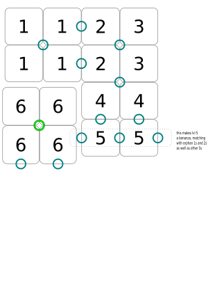

# Deckahedron Module: Leveling Up

`TODO`

Levels are represented by set collection.

As you learn skills, you get cards.  If the skill cards have partial
circles on them, you arrange them so the circles link up.  When
you gain a card that completes a circle, then you get to choose
a "Level bonus" token, and put that token in the circle.

The Level bonus token's border must match the border of the circle
you just competed.  Eg, you can't take fighter Lvl 1 bonus token if
you don't have an "F" circle to put it on.

The bonus tokens have little icons in them that have meanings.  They
could be new actions, skills, or attributes.

The circle at level 6 gives the ability to move a stat up a level

# TODO: ideas for level progression

## Thief

 * Hide your green tokens from the GM

 * Turncoat: Reveal that an NPC is actually on a different side than assumed
   * You say specifically whose side the NPC is *not* on
   * The GM will decide whose side they are on instead

 * Red Herring: What was thought to be a critical resource is actually a decoy,
   bluff, or an illusion

## Level 1

### Getting the Hang of This

Spot for Two Stamina

### Eager Learner

When you increase a skill level by flipping a green symbol, take a
Blessing Card and shuffle it into your Deckahedron.

### It's in here somewhere

When you use Good Thing I Brought..., take out the top 4 cards of your
Deckahedron and match their corners into a square shape or a triangle shape.
If you can do this, you only need to spend 1 EQUIP.

While trying to match corners, the narrative progresses and other players can make moves.

You can give up at any time.

### Rallying Cry

When you Critical Flip, act out the rallying cry shouted by your character.
Then, invite another player to use the advantage instead of you.
They must use the advantage right now, and their character must be in
the same scene, and they must spend the usual 1 green token.

If they do it, take a Blessing Card, shuffle it into your Deckahedron,
and flip this card over.

**Over**: when you resolve a flip with a Blessing Card, you may
discard the Blessing Card and flip *only* this card over.

### Background (Anchor)

Write a word or phrase that indicates part of your character's background.
When you're in a situation where this background would be useful, and you flip
to resolve a move, flip an Anchor as well. If your Anchor card is better than
the card you resolved your move with, resolve with that card instead.

The GM may write a downside or limitation on this card if your Background is
too broad or advantageous.

When you take Background (Bulb) or Background (Crescent), you can flip this
over and write something new on it.

## Later levels

### Taste for Adventure TODO: this is too complicated

Side 1: When you put the first card in your Exhaustion pile, take a
Blessing Card and shuffle it into your Deckahedron.

Then flip this card over.

Side 2: When you resolve a flip with a Blessing Card, discard that Blessing
Card, but use it like a Critical Flip - 1 Green Token for Advantage on a new
move right now.

When you do this, discard the Blessing Card and flip *only* this card over.

### You should meet my friend

Introduce an NPC

 * What is your relationship
 * How you think they can help
 * The GM says where you can find them

## Misc

 * "I'm good for it": When you spend Wealth in a Steading and make
    a show of it, word gets around.  Flip Anchors.  On ✔ or ✔✔ you
    can convince townsfolk to trade with you "on credit" for a few
    days. There may be fictional consequences if you don't pay your
    debts though. (IMMEDIATE)

